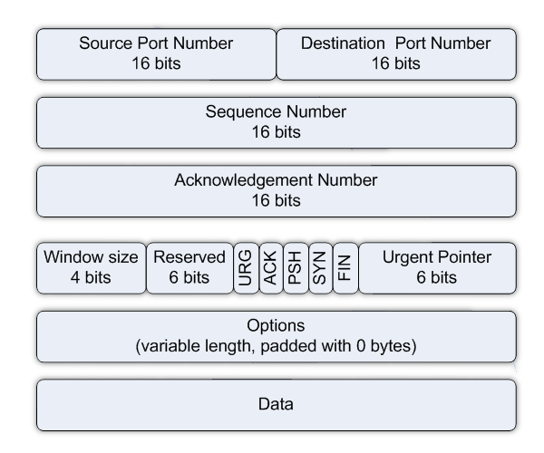
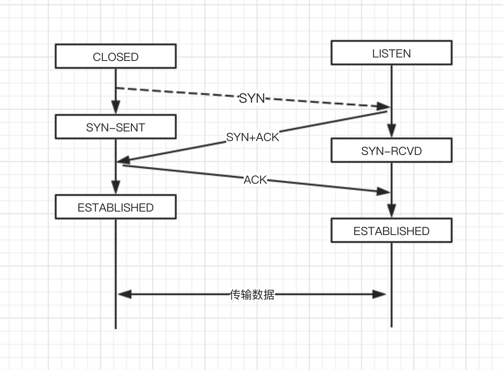
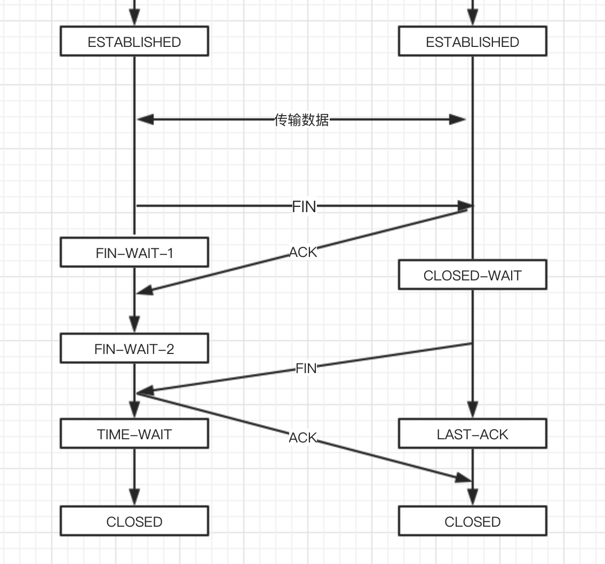
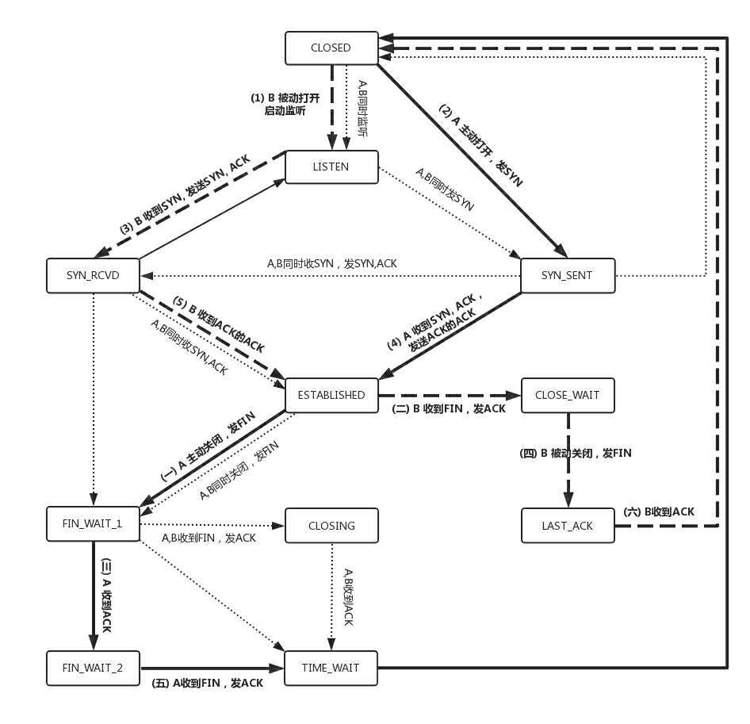

### 1. TCP的特点：一个有状态的服务

1. 面向连接： TCP是面向连接的单播协议，在发送数据前，通信双方必须在彼此间建立一条连接。所谓连接是通信双方建立一定的数据结构来维护双方交互的状态。
2. 可靠： 处理IP层或以下层的丢包、重复以及错误问题。
3. 面向字节流：发送的时候发的是一个流，没头没尾。
4. 有拥塞控制：它意识到丢包或者网络环境不好，就会根据情况调整自己的行为，看看是不是发快了，要不要发慢点

### 2. TCP包头格式

+ 源端口和目标端口用于确定双方通信的进程；
+ 报文序号：用于解决乱序问题；
+ 确认序号：发出去的包由确认，用于解决丢包问题；
+ 状态位：
  1. SYN: 表示发起一个连接；
  2. ACK：确认，使得确认号有效；
  3. RST：重置连接，经常见到的reset by peer就是这个字段搞的鬼
  4. FIN：结束连接，发送方结束向对方发消息
+ 窗口大小：TCP要做流量控制，通信双方各申明一个窗口，标识自己的处理能力

### 3. TCP的三次握手

TCP进行三次握手是为了确认双方的状态都是正常的。

第一次握手：客户端发出网络包SYN，服务端如果接收到，这表明客户端的发送能力、服务器端的接受能力都是正常的；

第二次握手：服务端发包SYN+ACK，客户端成功收到，客户端会认为服务端的接收发送能力都正常，客户端的接收发送能力正常

第三次握手：客户端发出ACK的包，服务端能到的结论：客户端的发送接收能力正常，服务器端发送接收能力正常，双方可以进行业务数据的发送。

**通信双方至少需要三次握手过程才能确认双方的工作状态正常。三次以上握手也可以但没有必要。**三次握手除了双方建立连接外，主要还是为了**通知对方自己的TCP包的序号从哪开始。**

### 4. TCP四次挥手

TCP四次挥手过程：

1. 客户端发出FIN包，进入FIN_WAIT_1状态，表明客户端不在发送数据，但还可以接收数据。服务端收到后发送应答ACK，就进入了CLOSE_WAIT状态。这时不能直接关闭连接，应用层可能有没有完成的任务，还需要发送一些数据。
2. 客户端收到FIN的应答包后进入FIN_WAIT_2状态，这时候如果服务器端挂了，linux有个tcp_fin_timeout的参数，可以控制超时等待时间。
3. 服务端完成最后的数据发送后，发出FIN包，告诉客户端服务端也要关闭连接了并进入LAST_ACK状态。客户端收到FIN后进入TIME_WAIT状态；TIME_WAIT默认等待时间是2*MSL; MSL是Maximum Segment LifeTime， 报文最大生存时间。
4. 客户端收到FIN后按理说可以直接关闭了，为什么会有TIME_WAIT状态呢？客户端要等待FIN ACK的应答包，保证到达服务端，如果没有ACK，客户端会重发一个FIN ACK的包，并有足够的时间到达服务端。同时客户端直接关闭还有问题是，客户端的端口就直接空出来了，但服务端不知道，服务端原来的包可能还在路上，如果客户端的端口被一个新的应用占用了，这个新的应用会受到上一个连接中服务端发过来的包，为防止产生混乱，因而需要等待足够长的时间，等到原来的服务端发送的所有包都到达了，再空出端口。

### 5. TCP状态机

