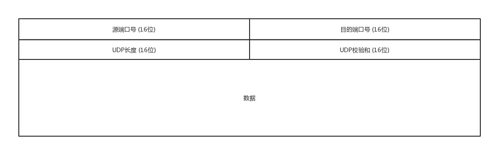
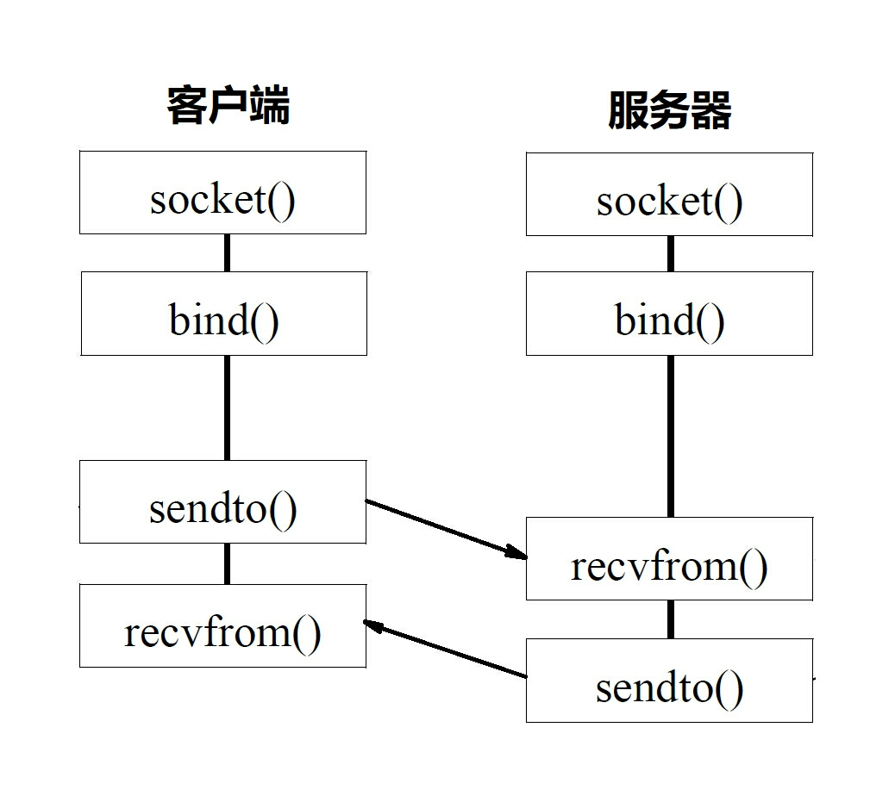

## 1. UDP的特点

+ UDP面向无连接：所谓建立连接是为了在客户端和服务器端维护连接，建立一定的数据结构来维护双方的状态，用这样的数据结构来保证所谓面向连接的特征
+ UDP是不可靠的：继承了IP包的特征，不保证不丢失，不保证顺序到达；
+ 基于数据报的，一个一个的发，一个一个的接；
+ TCP有拥塞控制，UDP没有，应用让其发送就立即发送；

## 2. UDP包头

UDP的包头非常的简单，端口号是为了区分应用，其他字段都是通信报文最简单最基础的信息。

## 3. UDP的使用场景

1. **需要资源少，在网络情况比较好的内网，或者对于丢包不敏感的应用；** DHCP协议就是基于UDP的
2. **不需要一对一沟通，建立连接，而是可以广播的应用；**
3. **需要处理速度快，时延地，可以容忍少数丢包**

## 4. Socket实现UDP编程

UDP没有连接，所以不需要三次握手，也就不需要调用listen和connect函数，但UDP交互仍然需要端口，因而需要bind函数。UDP不维护连接的状态，因而不需要没对连接建立一组Socket，而是只要一个Socket就可以和多个客户端通信。也正是因为没有连接状态，每次通信时，都要调用sendto和recvfrom，都需传入IP地址和端口。

