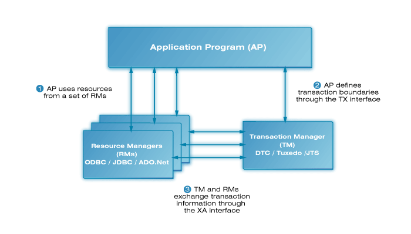
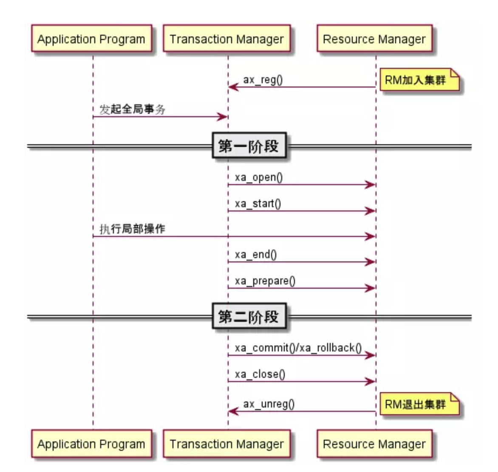
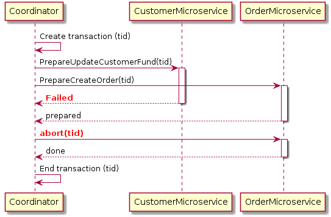

# 1. X/Open DTP Model

**X/Open Distributed Transaction Processing (DTP)**模型定义了处理分布式事务的方式。DTP包含了三个核心组件：

+ Application Program(AP) 应用服务器: 定义事务的边界，决定哪些是参与事务的分支。
+ Resource Managers(RMs)资源管理器:  可以是数据库，数据库Drivers，SOA服务
+ Transaction Manager（TM）事务管理器：负责协调和管理事务，提供给AP编程接口及管理资源管理器





XA的主要问题：

1. **同步阻塞**：所有参与事务锁定的资源其他事务阻塞。

2. **单点故障**：TM发生故障，RM会阻塞。

3. **数据不一致**：在二阶段提交的阶段二中，当协调者向参与者发送commit请求之后，发生了局部网络异常或者在发送commit请求过程中协调者发生了故障，导致只有一部分参与者接受到了commit请求。而在这部分参与者接到commit请求之后就会执行commit操作。但是其他部分未接到commit请求的机器则无法执行事务提交。于是整个分布式系统便出现了数据不一致性的现象。

   

# 2. Mysql XA事务

MySQL 从5.0.3开始支持XA分布式事务，且只有InnoDB存储引擎支持。MySQL Connector/J 从5.0.0版本之后开始直接提供对XA的支持。


## 1. XA语法

```SQL
XA {START|BEGIN} xid [JOIN|RESUME] // 开启事务

XA END xid [SUSPEND [FOR MIGRATE]] // 事务进入IDLE状态，并不是结束事务，后续还有两阶段prepare、commit

XA PREPARE xid  // 准备提交，标识两阶段的第一阶段，通知资源管理器进行提交前的准备

XA COMMIT xid [ONE PHASE] // 提交事务

XA ROLLBACK xid // 回滚事务

XA RECOVER [CONVERT XID] // 查看哪些已经完成prepare
```


```SQL
mysql> xa start 'abc';
Query OK, 0 rows affected (0.00 sec)

mysql> update storage_tbl set count = -1;
Query OK, 1 row affected (0.00 sec)
Rows matched: 1  Changed: 1  Warnings: 0

mysql> select * from storage_tbl;
+----+----------------+-------+
| id | commodity_code | count |
+----+----------------+-------+
|  4 | C00321         |    -1 |
+----+----------------+-------+
1 row in set (0.00 sec)

mysql> xa end 'abc';
Query OK, 0 rows affected (0.00 sec)

mysql> xa recover;
Empty set (0.00 sec)

mysql> xa prepare 'abc';
Query OK, 0 rows affected (0.00 sec)

mysql> xa recover;
+----------+--------------+--------------+------+
| formatID | gtrid_length | bqual_length | data |
+----------+--------------+--------------+------+
|        1 |            3 |            0 | abc  |
+----------+--------------+--------------+------+
1 row in set (0.00 sec)

mysql> xa commit 'abc';
Query OK, 0 rows affected (0.00 sec)

mysql> xa rollback 'abc';
ERROR 1397 (XAE04): XAER_NOTA: Unknown XID
mysql>
```


# 3. 微服务下的分布式事务

基于微服务的任务处理例子：


​								

**怎样实现各个服务之间的数据一致？**

## 1. 2PC





## 2. saga


## 3. TCC

TCC是try-confirm-cancel的单词首字母缩写，是一个类2PC的柔性事务解决方案。


1. TRY阶段: 主要做资源的锁定/预留，设置一个预备的状态，冻结部分数据

   比如：电商平台先在订单模块做下单操作，下单成功后调用库存模块做扣减库存，扣减成功调用支付接口进行支付，然后调用积分模块做积分的增加，最后调用发货模块做发货处理。

   这个过程中的Try阶段描述如下：

   订单服务先做*下单*操作，这是个本地事务，能够保证ACID的事务特性。下单成功后，订单服务将当前订单状态由初始化改为处理中进行扣库存操作，这里不能直接将库存扣除，应当冻结库存，将库存减去后，将减去的值保存在**已冻结**的字段中。

   例如：本来库存数量是100，要减去5个库存，不能直接100 - 5 = 95，而是要把可销售的库存设置为：100 - 5 = 95，接着在一个单独的**库存冻结**的字段里，设置一个5。也就是说，有5个库存是给冻结了。

   此时订单状态为**OrderStatus.DEALING**。

   接着进行*支付*操作。那么。为什么不直接进行支付，然后改为支付完成呢？因为存在支付失败甚至支付未知的风险，只要进行了支付操作，订单状态就不是初始化了。也就是说，不能直接把订单状态修改为已支付的确认状态！而是应当先把订单状态修改为**DEALING**，也就是处理中状态。该状态是个没有任何含义的中间状态，代表分布式事务正在进行中。

   *积分*服务的增加积分接口也是同理，不能直接给用户增加会员积分。可以先在积分表里的一个预增加积分字段加入积分。

   比如：用户积分原本是1000，现在要增加100个积分，可以保持积分为1000不变，在一个预增加字段里，设置一个100，表示有100个积分准备增加。

   *发货*服务的发货接口也是同理，可以先创建一个发货订单，并设置这个销售出库单的状态是“DEALING”。

   也就是说，刚刚创建这个发货订单，此时不能确定他的状态是什么。需要等真实发货之后再进行状态的修改。

   这整个过程也就是所谓的TCC分布式事务中的TRY阶段。

   简而言之，TRY阶段的业务的主流程以及各个接口提供的业务含义，不是直接完成那个业务操作，而是完成一个资源的预准备的操作，状态均为过渡态。

2. confirm阶段

   常见的TCC框架，如：**ByteTCC、tcc-transaction** 均为我们实现了事务管理器，用来执行CONFIRM阶段。他们能够对各个子模块的try阶段执行结果有所感知。

   感知各个阶段的执行情况以及推进执行下一个阶段的操作较为复杂，不太可能自己手写实现，我们最好是借助开源框架实现。

   为了实现这个阶段，我们需要加入CONFIRM操作相关的代码做事务的提交操作。

   接着上述的情景来说：

   1. *订单*服务中的CONFIRM操作，是将订单状态更新为**支付成功**这样的确定状态。
   2. *库存*服务中，我们要加入正式扣除库存的操作，将临时冻结的库存真正的扣除，更新冻结字段为0，并修改库存字段为减去库存后的值。
   3. 同时*积分*服务将积分变更为增加积分之后的值，修改预增加的值为0，积分值修改为原值+预增加的100分的和。
   4. *发货*服务也类似，真实发货后，修改DEALING为已发货。

   当TCC框架感知到各个服务的TRY阶段都成功了以后，就会执行各个服务的CONFIRM逻辑。

   各个模块内的TCC事务框架会负责跟其他服务内的TCC事务框架进行通信，依次调用各服务的CONFIRM逻辑。正式完成各服务的完整的业务逻辑的执行。

3. CANCEL阶段

    CONFIRM是业务正常执行的阶段，那么异常分支自然交给CANCEL阶段执行了。

    接着TRY阶段的业务情景来说。

    1. *订单*服务中，当支付失败，CANCEL操作需要更改订单状态为**支付失败**
    2. *库存*服务中的CANCEL操作要将预扣减的库存加回到原库存，也就是可用库存=90+10=100
    3. *积分*服务要将预增加的100个积分扣除
    4. *发货*服务的CANCEL操作将发货订单的状态修改为**发货取消**

    当TCC框架感知到任何一个服务的TRY阶段执行失败，就会在和各服务内的TCC分布式事务框架进行通信的过程中，调用各个服务的CANCEL逻辑，将事务进行回滚。


TCC分布式事务的核心思想，就是当系统出现**异常**时，比如某服务的数据库宕机了；某个服务自己挂了；系统使用的第三方服务如redis、elasticsearch、MQ等基础设施出现故障了或者某些资源不足了，比如说库存不够等等情况下，先执行TRY操作，而不是一次性把业务逻辑做完，进行**预操作**，看各个服务能不能基本正常运转，能不能预留出需要的资源。

如果TRY阶段均执行ok，即，数据库、redis、elasticsearch、MQ都是可以写入数据的，并且保留成功需要使用的一些资源（比如库存冻结成功、积分预添加完成）。

接着，再执行各个服务的CONFIRM逻辑，基本上CONFIRM执行完成之后就可以很大概率保证一个分布式事务的完成了。

那如果TRY阶段某个服务就执行失败了，比如说底层的数据库挂了，或者redis挂了，那么此时就自动执行各个服务的CANCEL逻辑，把之前的TRY逻辑都回滚，所有服务都不执行任何设计的业务逻辑。从而保证各个服务模块一起成功，或者一起失败。

到这里还是不能保证完全的事务一致性，试想，如果真的发生服务突发性宕机，比如订单服务挂了，那么重启之后，TCC框架如何保证之前的事务继续执行呢？

这个其实不必担心，成熟的TCC框架比如TCC-transaction中引入了事务的活动日志，它们保存了分布式事务运行的各个阶段的状态。后台会启动一个定时任务，周期性的扫描未执行完成的事务进行重试，保证最终一定会成功或失败。

这里也体现了TCC解决方案是一个保证最终一致性的柔性事务解决方案。


