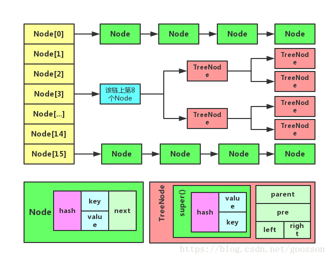

# 1. hasmap的基本概念



hashmap由数组和链表组成，jdk8对其进行了优化，采用红黑树来优化存取速度。

hashmap有几个重要的参数：

+ DEFAULT_INITIAL_CAPACITY：默认初始数组容量16；

+ DEFAULT_LOAD_FACTOR：负载因子，默认0.75
+ TREEIFY_THRESHOLD： 链表转换成红黑树的临界值
+ UNTREEIFY_THRESHOLD：红黑树转换成链表的临界值


### hashmap的构造方法

```java
public HashMap(int initialCapacity, float loadFactor) {
    if (initialCapacity < 0)
        throw new IllegalArgumentException("Illegal initial capacity: " +
                                           initialCapacity);
    if (initialCapacity > MAXIMUM_CAPACITY)
        initialCapacity = MAXIMUM_CAPACITY;
    if (loadFactor <= 0 || Float.isNaN(loadFactor))
        throw new IllegalArgumentException("Illegal load factor: " +
                                           loadFactor);
    this.loadFactor = loadFactor;
    this.threshold = tableSizeFor(initialCapacity);
}

/**
 * Constructs an empty <tt>HashMap</tt> with the specified initial
 * capacity and the default load factor (0.75).
 *
 * @param  initialCapacity the initial capacity.
 * @throws IllegalArgumentException if the initial capacity is negative.
 */
// 指定“容量大小”的构造函数
public HashMap(int initialCapacity) {
    this(initialCapacity, DEFAULT_LOAD_FACTOR);
}

/**
 * 
 * Constructs an empty <tt>HashMap</tt> with the default initial capacity
 * (16) and the default load factor (0.75).
 */
// 默认构造函数
public HashMap() {
    this.loadFactor = DEFAULT_LOAD_FACTOR; // all other fields defaulted
}
```


# 2. hashmap put源码

​    

```java
    // 对外API
    public V put(K key, V value) {
        return putVal(hash(key), key, value, false, true);
    }

    /**
     * Implements Map.put and related methods
     *
     * @param hash hash for key
     * @param key the key
     * @param value the value to put
     * @param onlyIfAbsent if true, don't change existing value
     * @param evict if false, the table is in creation mode.
     * @return previous value, or null if none
     */
    final V putVal(int hash, K key, V value, boolean onlyIfAbsent,
                   boolean evict) {
        // 定义一个数组，一个链表，n存放数组的长度，存放key存放位置的数组索引
        Node<K,V>[] tab; Node<K,V> p; int n, i;
        // 第一次调用时，table为null，让数组初始化，n为数组长度
        if ((tab = table) == null || (n = tab.length) == 0)
            n = (tab = resize()).length;
        // 根据key经过hash之后得到的hash值与数组最大索引做于运算得到当前key的索引位置
        if ((p = tab[i = (n - 1) & hash]) == null)
            // 如果要放入的位置为null，直接创建Node对象存储数据
            tab[i] = newNode(hash, key, value, null);
        else {
            // 该位置存在数据情况
            Node<K,V> e; K k;
            // 如果hash值相等，key也相等，则将其引用赋予e，以便以后进行值覆盖
            if (p.hash == hash &&
                ((k = p.key) == key || (key != null && key.equals(k))))
                e = p;
            
            // 如果是红黑树节点
            else if (p instanceof TreeNode)
                // 用红黑树插值法找到数据位置
                e = ((TreeNode<K,V>)p).putTreeVal(this, tab, hash, key, value);
            else {
                // 链表节点第一个位置不是要存入的key，也不是红黑树，遍历当前链表找到要存入的位置
                for (int binCount = 0; ; ++binCount) {
                    if ((e = p.next) == null) {
                        p.next = newNode(hash, key, value, null);
                        if (binCount >= TREEIFY_THRESHOLD - 1) // -1 for 1st
                            treeifyBin(tab, hash);
                        break;
                    }
                    if (e.hash == hash &&
                        ((k = e.key) == key || (key != null && key.equals(k))))
                        break;
                    p = e;
                }
            }
            if (e != null) { // existing mapping for key
                V oldValue = e.value;
                if (!onlyIfAbsent || oldValue == null)
                    e.value = value;
                afterNodeAccess(e);
                return oldValue;
            }
        }
        ++modCount;
        // 当最后插入数据后Size大于了临界值，需要调整数组容量
        if (++size > threshold)
            resize();
        afterNodeInsertion(evict);
        return null;
    }
```


