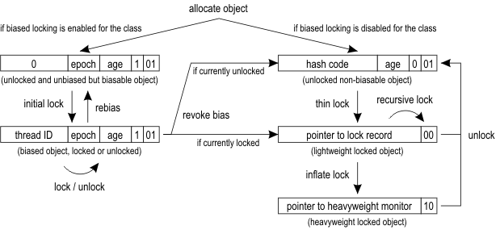

## 0. java代码如何执行

​	执行java代码首先需要将编译生成的class文件加载到方法区。jvm同样在内存中换分出堆和栈来存储运行时数据。在运行过程中，每当调入一个方法，jvm会在当前线程栈中生产栈帧，以存储局部变量及操作数。当退出当前方式时，弹出当前栈帧。

​	从硬件角度来看，class字节码无法直接执行，是jvm将字节码翻译成机器码。翻译过程有：解释执行，即逐条将字节码翻译成机器码；即时编译：将一个方法中所有的字节码编译优化生成机器码在执行。HotSpot默认会先解释执行字节码，而后将反复执行的热点代码，以方法为单位进行即时编译。


## 1.  jvm基本结构

+ 类加载子系统：负责从文件系统或网络中加载Class信息并存放在方法区；

+ heap：几乎所有的对象实例存放在heap中，为所有线程共享；

+ 直接内存：NIO库可以直接使用堆外内存，通常访问速度优于堆，但分配速度慢，适用于一次分配多次读取的场景；

+ 垃圾回收系统：对方法区、heap、直接内存进行回收；

+ java栈：每一个线程都有一个私有的栈；

+ 本地方法栈：与java栈类似，但用于本地方法执行；

+ PC寄存器：线程私有空间，每个线程都有一个，指向当前正在被执行的指令，如果正在执行本地方法则为undefined

+ 执行引擎：负责执行虚拟机的字节码；

  

### 1.2. 什么是堆？

根据垃圾回收机制的不同，堆有不同的结构，最常见的是将堆分成老年代和新生代。


当我们调用new指令时，它会在Eden区中划出一块作为存储对象的内存。由于堆空间是线程共享的，因此直接在这里划分空间是需要进行同步的。jvm未避免同步采用TLAB（Thread Local Allocation Buffer，对应虚拟机参数是-XX:+UseTLAB, 默认开启）技术先为每个线程申请一段连续的内存。当new新对象时直接在这段内存中分配，如果这段内存已经用完再重新申请一段Buffer。


### 1.3. java栈

+    程执行的基本行为是函数调用，每一次函数调用，都会有一个对应的栈帧入栈，函数调用结束栈帧弹出。当前正在执行的函数对应的帧位于栈顶，保存着当前函数的局部变量、中间运算结果等数据；一个栈帧中至少包含局部变量表、操作数栈和帧数据区；
+ -Xss指定线程的最大栈空间；
+ 局部变量表：用于保存函数的参数以及局部变量。可以使用jclasslib查看。
+ 操作数栈：用于保存计算过程的中间结果，同时作为计算过程中变量的临时存储空间，也是一个先进后出的数据结构；；
+ 帧数据区：保存着访问常量池的指针，方便访问常量池；同时保存着异常处理表，方便在发生异常的时候找到处理异常的代码；
+ 栈上分配：jvm提供的一项优化技术，基本思路是对于那些线程私有的对象，可以将他们打散分配到栈上，而不是分配到堆上，这样当函数调用结束后可以自行销毁，不需要垃圾回收器介入，从而提高系统性能。逃逸分析是该技术的基础。栈上分配的例子：

```Java
public class TestEscape {

    public static class User{
        public int id;
        public String name;

    }

    public static void main(String[] args) {
        long b = System.currentTimeMillis();
        for (int i = 0; i < 1e8; i++) {
            alloc();
        }
        long e = System.currentTimeMillis();
        System.out.println(e-b);
    }

    private static void alloc() {
        User u = new User();
        u.id = 2;
        u.name = "yss";
    }

}
jvm运行参数：
-server -Xmx10m -Xms10m -XX:+DoEscapeAnalysis -XX:+PrintGCDetails -XX:-UseTLAB -XX:+EliminateAllocations
```

### 1.4. 方法区

+ 线程共享区域，用于保存类信息。在1.7中，方法区可以理解为永久区，在1.8中永久区被移除，取而代之的是元数据区，元数据区的大小由-XX:MaxMetaspaceSize指定。如果元数据区发生溢出，虚拟机一样会抛出OOM

  异常。


## 2. 常用JVM参数

### 2.1 垃圾回收日志打印

+ -XX:+PrintGC,  打印GC简略日志，类似如下：

`[GC 345536K->790K(1048064K), 0.0003551 secs]`

在GC前，堆空间使用量为345M，GC后，堆空间使用量为790K，可用堆空间是1048M；

+ -XX:+PrintGCDetails可以输出更详细的信息：

  [GC  [PSYoungGen: 53205K->256K(64512K)] 65846K->12968K(201216K), 0.0014672 secs] [Times: user=0.01 sys=0.00, real=0.00 secs] 

  [GC  [PSYoungGen: 42476K->224K(64512K)] 55188K->23232K(201216K), 0.0073756 secs] [Times: user=0.05 sys=0.00, real=0.01 secs] 

  [Full GC  [PSYoungGen: 224K->0K(64512K)] [ParOldGen: 23008K->12644K(136704K)] 23232K->12644K(201216K), [Metaspace: 9212K->9212K(1058816K)], 0.0135689 secs] [Times: user=0.07 sys=0.00, real=0.01 secs] 

   前两条是YoungGc日志，最后一条是Full GC，新生代从224K变为0K，整个可用新生代大小为64512K，老年代从23008K变为12644K，整个可用老年代大小为136704K，整个堆从23232K变为12644K，整个堆大小为201216K，元空间没有垃圾回收，大小为1058816K；

  在jvm退出时，还会打印堆的详细信息：

   PSYoungGen      total 65536K, used 53866K [0x00000007bbd80000, 0x00000007c0000000, 0x00000007c0000000)
    eden space 62976K, 85% used [0x00000007bbd80000,0x00000007bf1f2ab0,0x00000007bfb00000)
    from space 2560K, 6% used [0x00000007bfd80000,0x00000007bfda8000,0x00000007c0000000)
    to   space 2560K, 0% used [0x00000007bfb00000,0x00000007bfb00000,0x00000007bfd80000)

  

   ParOldGen       total 136704K, used 13180K [0x00000007b3800000, 0x00000007bbd80000, 0x00000007bbd80000)

    object space 136704K, 9% used [0x00000007b3800000,0x00000007b44df1b8,0x00000007bbd80000)
   Metaspace       used 9440K, capacity 9874K, committed 9984K, reserved 1058816K
    class space    used 1109K, capacity 1224K, committed 1280K, reserved 1048576K

  末尾的三个十六进制代表各区域的堆空间下界、当前上界、上界；

  如：（0x00000007c0000000 - 0x00000007bbd80000）/ 1024 = 68096K = eden space + from space + to space

+ -XX:PrintHeapAtGC: 可以在每次GC前后分别打印堆信息

  {Heap before GC invocations=2 (full 0):
   PSYoungGen      total 59904K, used 43148K [0x00000007bbd80000, 0x00000007c0000000, 0x00000007c0000000)
    eden space 51712K, 81% used [0x00000007bbd80000,0x00000007be67a008,0x00000007bf000000)
    from space 8192K, 14% used [0x00000007bf000000,0x00000007bf129300,0x00000007bf800000)
    to   space 8192K, 0% used [0x00000007bf800000,0x00000007bf800000,0x00000007c0000000)
   ParOldGen       total 136704K, used 8K [0x00000007b3800000, 0x00000007bbd80000, 0x00000007bbd80000)
    object space 136704K, 0% used [0x00000007b3800000,0x00000007b3802000,0x00000007bbd80000)
   Metaspace       used 3349K, capacity 4496K, committed 4864K, reserved 1056768K
    class space    used 366K, capacity 388K, committed 512K, reserved 1048576K
  Heap after GC invocations=2 (full 0):
   PSYoungGen      total 59904K, used 928K [0x00000007bbd80000, 0x00000007c0000000, 0x00000007c0000000)
    eden space 51712K, 0% used [0x00000007bbd80000,0x00000007bbd80000,0x00000007bf000000)
    from space 8192K, 11% used [0x00000007bf800000,0x00000007bf8e8000,0x00000007c0000000)
    to   space 8192K, 0% used [0x00000007bf000000,0x00000007bf000000,0x00000007bf800000)
   ParOldGen       total 136704K, used 16K [0x00000007b3800000, 0x00000007bbd80000, 0x00000007bbd80000)
    object space 136704K, 0% used [0x00000007b3800000,0x00000007b3804000,0x00000007bbd80000)
   Metaspace       used 3349K, capacity 4496K, committed 4864K, reserved 1056768K
    class space    used 366K, capacity 388K, committed 512K, reserved 1048576K
  }

### 2.2 类加载卸载跟踪

- -verbose:class   可以跟踪类的加载和卸载

  `[Opened /Library/Java/JavaVirtualMachines/jdk1.8.0_181.jdk/Contents/Home/jre/lib/rt.jar]
  [Loaded java.lang.Object from /Library/Java/JavaVirtualMachines/jdk1.8.0_181.jdk/Contents/Home/jre/lib/rt.jar]
  [Loaded java.io.Serializable from /Library/Java/JavaVirtualMachines/jdk1.8.0_181.jdk/Contents/Home/jre/lib/rt.jar]
  [Loaded java.lang.Comparable from /Library/Java/JavaVirtualMachines/jdk1.8.0_181.jdk/Contents/Home/jre/lib/rt.jar]`

- -XX:+TraceClassLoading： 可以单独跟踪类的加载

- -XX:+TraceClassUnloading: 单独跟踪类的卸载

### 2.3  打印虚拟机参数

+ -XX:+PrintVMOptions:打印虚拟机的接受的显式参数
+ -XX:+PrintCommandLineFlags: 打印虚拟机的显式和隐式参数；

### 2.4 堆参数

+ 最大堆与最小堆设置：-Xmx -Xms
+ -Xmn可以设置新生代的大小。设置较大的新生代会减少老年代的大小。新生代大小一般设置为整个堆的1/3到1/4;
+ -XX:SurvivorRatio=eden/from: 设置新生代中的eden与from/to空间的比例

​        如下面的参数： -Xmn2m -XX:SurvivorRatio=2  设置了新生代共2048K，eden空间为1024K，from/to为512K，可用新生代就是1024K+512K=1536K；

​     默认情况下，java虚拟机采取一种动态分配的策略（-XX:+UsePSAdaptiveSurvivorSizePolicy）, 根据生成对象的速率，以及Survivor区的使用情况动态调整Eden和Survivor区的比例。

+ 设置老年代与新生代的比例：-XX:+NewRatio=老年代/新生代
+ -XX:+HeapDumpOnOutOfMemoryError: 设置在堆溢出时，导出整个堆信息；
+ -XX:HeapDumpPath=dump file path: 设置导出堆文件的存放路径；

### 2.5 堆外内存设置

+ -XX:MaxMetaspaceSize:指定元数据区大小
+ -XX:MaxDirectMemorySize: 指定最大直接内存，如果不设置默认是最大堆空间即-Xmx的值


## 3 垃圾回收算法

### 3.1 如何确定垃圾

1. **引用计数**： 对于任意一个对象A，只要有任意一个对象引用了A，则A的引用计数器就加1，当引用失效时，引用计数减1。只要引用计数为0就可回收。

   面临的问题：

   ​	1. 循环引用

   ​        2. 引用计数器要求在每次引用产生和消除的时候，伴随这加减操作，对系统性能有一定影响

2. **可达性分析**：目前主流的对象存活判定方案。基本思路是把所有引用的对象想象成一棵树，从数的根节点GC Roots出发，持续遍历找出所有连接的对象，这些对象称为“可达”对象，或称“存活”对象，其余的对象是“不可达”对象，或称“垃圾”。

   哪些可以是GC Roots：

   1. jvm栈中的对象
   2. 方法区静态属性的引用
   3. 方法区中常量引用的对象
   4. 本地方法栈中JNI引用的对象

### 3.2 标记清除算法

标记清除算法是现代垃圾回收算法的思想基础。标记清除算法将垃圾回收分为两个阶段：标记阶段和清除阶段。在标记阶段，从根节点GC Root出发，标记所有可达对象。未被标记的对象就是垃圾对象。然后在清除阶段，清除所有未标记对象。这种算法最大的问题是产生空间碎片。


### 3.3 复制算法

复制算法的核心思想是：将原有的内存空间分成两块，每次只使用其中的一块，在垃圾回收时，将正在使用的内存区域的存活对象复制到未使用的内存区，之后清除正在使用的内存块，最后交换两个内存区域的角色。


​	如果系统中垃圾对象比较多，存活比较少，复制算法效率较高。但这种算法会使可用内存减半，因此单纯使用复制算法是不可接受的。

​	在JVM新生代的回收中使用了复制算法。新生代被分成了Eden和from、to两块内存大小地位完全相同的内存块。

### 3.4 标记压缩算法


标记压缩算法等同于标记清除算法执行完成后，在进行一次内存碎片整理。

### 3.5 分代算法

​	分代算法的特点是根据垃圾回收对象的特点，使用合适的算法。jvm几乎将所有新建对象都放入新生代。新生代的特点是对象朝生夕灭，大约90%的新建对象很快会被回收，因此新生代比较适合复制算法。老年代是经过几次对象回收后仍然存活的对象。存活率较高，使用复制算法就需要复制大量对象，代价较高。因此，老年代可以采用标记压缩或标记清除算法。

​	新生代回收频率高，为了缩短耗时，JVM可能采用一种叫Card Table的数据结构来快速扫描老年代。

### 3.6 分区算法

分区算法将整个堆划分成连续的不同小区间。每个小区间单独使用，独立回收。这种算法的好处可以控制每次回收多少个小区间，从而控制GC产生的停顿。


## 4. 垃圾回收器

### 4.1 串行垃圾回收器

+ 它仅仅使用单线程进行垃圾回收。在但CPU等硬件平台不够优越时可以考虑使用。
+ -XX:+UseSerialGC指定使用新生代和老年代串行收集器。
+ -XX:+UseParNewGC: 新生代使用ParNew回收器，老年代使用串行收集器，**java8中使用会出现警告**；
+ -XX:+UseParallelGC: 新生代使用ParallelGC回收器，老年代使用串行收集器；

### 4.2 新生代ParNew回收器

+ ParNew是工作在新生代的垃圾回收器，是串行垃圾回收器的多线程化
+ -XX:+UseConcMarkSweepGC:新生代使用ParNew回收器，老年代使用CMS

### 4.3 新生代ParallelGC回收器

+ ParallelGC与ParNew一样也是多线程、独占式收集器，但它显著的特点是非常关注吞吐量。
+ ParallelGC提供两个重要参数用于控制系统的吞吐量：
  1. -XX:MaxGCPauseMills: 设置垃圾收集最大停顿时间。ParallelGC在工作时，会调整Java堆的大小或者一些其他参数，尽可能把停顿时间控制在MaxGCPauseMills以内。
  2. -XX:GCTimeRatio: 设置垃圾回收时间占整个系统的比率，是0到100之间的整数。垃圾回收时间的比例小于1/(1+GCTimeRatio)
+ -XX:+UseAdaptiveSizePolicy: 打开自适应GC策略。在这种模式下，新生代的大小，eden和survivor的比例、晋升老年代的对象年龄等参数自动调整，以达到在堆大小、吞吐量和停顿时间的平衡点。
+ -XX:+UseParallelOldGC: 新生代使用ParallelGC，老年代使用ParallelOldGC

### 4.4 老年代ParallelOldGC回收器

+ 与ParallelGC对应，是应用于老年代关注吞吐量的收集器；
+ ParallelOldGC使用的是标记压缩算法；

### 4.5 CMS回收器

+ 使用标记清除算法，关注系统停顿时间，多线程并行、非独占式收集器；


## 5. 类加载机制

从class文件到内存中的类，需要经过加载、链接和初始化三大步骤。

### 5.1 加载

+ 加载是查找字节流，并据此创建类的过程。**对于数组类，它没有字节流，而是由jvm直接生成。**
+ Bootstrap classloader是首先启动的加载器，由C++开发，负责jre/lib下的jar包中的类，以及由虚拟机参数-Xbootclasspath指定的类；
+ Extension ClassLoader： 加载jre/lib/ext目录下的jar包，以及系统变量java.ext.dirs指定的类
+ Application ClassLoader：负责加载应用程序路径下的类，包括-cp、java.class.path、CLASSPATH指定的类
+ 双亲委派机制：当一个类加载器接收到加载请求时，会先将请求转发给父类加载器。在父类加载器没有找到的情况下，该类加载器才会尝试去加载；

### 5.2 链接

+ 链接是指将创建成的类合并至虚拟中，使之能执行的过程。可分为验证、准备、解析三阶段。
+ 验证的目的是保证加载的类能满足虚拟机的约束条件。
+ 准备阶段的目的是为加载类的静态字段分配内存；
+ 解析将编译器生成的符号引用解析成实际引用；

### 5.3 初始化

为标记为常量值的字段赋值，以及执行<clinit>方法的过程。

## 6. Synchronized

声明synchronized代码块时，编译而成的字节码将包含monitorenter和monitorexit指令。当synchronized标记方法时，字节码方法的访问标记包含ACC_SYNCHRONIZED，表示进入方法时执行monitorenter，退出时执行monitorexit。

+ 重量级锁

  jvm中最基础的锁实现， 是通过互斥量（Mutex）实现的。在这种情况下，jvm会阻塞加锁失败的线程，当锁释放时唤醒这些线程。这些线程的阻塞和唤醒，都是依靠操作系统完成，将涉及到系统调用，需要从用户态切换到内核态，开销较大。

+ 自旋锁

  为了尽量避免线程的阻塞及唤醒，jvm会在线程进入阻塞之前和唤醒之后仍然没有获取锁的情况下，进入自旋状态，在处理器上空跑并且轮询锁是否被释放。如果此时锁恰好被释放了，那么当前线程无需进入阻塞状态，而直接获取这把锁。

  1. 与线程阻塞相比，自旋状态可能浪费大量处理器资源，于是JVM提供了自适应自旋，根据以往自旋等待能否获得锁，来动态调整自旋时间。
  2. 会造成不公平锁机制。处于阻塞状态的线程并不能立即竞争释放的锁，很可能处于自旋状态的线程优先获取锁。

+ 轻量级锁

  

轻量级锁是JDK6引入的，它的轻量是相对于通过系统互斥量实现的重量级锁。它并不是用来取代重量级锁，而是在没有大量线程竞争的情况下，减少系统互斥量的使用，降低性能的损耗。轻量级锁是通过CAS机制实现的，即如果锁被其他线程占用，当前线程通过自旋来获取锁，从而避免用户态与核心态的转换。

对象头的mark word最后两位用来表示对象锁的状态。00表示轻量级锁，01代表无锁或偏向锁，10代表重量级锁。当进行加锁操作时，jvm会判断是否是重量级锁。如果不是，它会在当前线程的栈中划出一片空间，作为该锁的锁记录，并将锁对象的标记字段复制到该记录中。它针对的是多个线程在不同时段申请同一把锁的情况。

+ 偏向锁

  偏向锁也是JDK6引入的，它存在的依据是“大多数情况下，锁不仅不存在多线程竞争，而且总是由同一个线程获取”。它是通过记录第一次进入同步块的线程id来实现的，如果下一个要进入同步块的线程与记录的线程id相同，则说明这个锁由此线程占有，可以直接进入到同步块，不需要执行CAS。

  偏向锁只会在第一次请求时采用CAS操作，在锁对象的标记字段记录下当前线程的地址。之后在运行过程中，持有该偏向锁的线程在加锁操作将直接返回。它针对的是仅会被同一线程持有的情况。

#### 注意：锁只能升级不能降级

## 7. JMM与happens-before

1. **重排序**：编译器或运行时环境为了优化程序性能而采取的对指令进行重新排序执行的一种手段。重排序分为两类：编译器重排序和运行期重排序，分别对应编译时和运行时环境。但编译器需要保证程序能够遵守as-if-serial属性。通俗来讲，在单线程情况下，经过指令重排的执行结果与顺序执行的结果保持一致。

2. **happens-before**：用来描述两个操作的内存可见性。如果操作X happens-before操作Y，那么X的结果对于Y可见。

   java内存模型定义了下述happens-before关系：

   1. 解锁操作 happens-before 之后对同一把锁的加锁操作。

   2. volatile 字段的写操作 happens-before 之后对同一字段的读操作。
   3. 线程的启动操作（即 Thread.starts()） happens-before 该线程的第一个操作。
   4. 线程的最后一个操作 happens-before 它的终止事件（即其他线程通过 Thread.isAlive() 或 Thread.join() 判断该线程是否中止）
   5. 线程对其他线程的中断操作 happens-before 被中断线程所收到的中断事件（即被中断线程的 InterruptedException 异常，或者第三个线程针对被中断线程的 Thread.interrupted 或者 Thread.isInterrupted 调用)
   6. 构造器中的最后一个操作 happens-before 析构器的第一个操作

3. 解决数据竞争问题的关键在于构造一个跨线程的happens-before关系：操作X hanppens-before操作Y，使得操作X之前的字节码结果对操作Y之后的字节码可见。

4. java内存模型是通过内存屏障来禁止重排序实现的。对于即时编译器来说，内存屏障将限制它所能做的重排序优化。对于处理器来说，内存屏障会导致缓存的刷新操作。


## 8. 监控工具

1. vmstat：统计内存CPU的使用情况

   ```shell
   [root@henghe-125 ~]# vmstat 1 3  //每秒采集一次，共计三次
   procs -----------memory---------- ---swap-- -----io---- -system-- ------cpu-----
    r  b   swpd   free   buff  cache   si   so    bi    bo   in   cs us sy id wa st
    1  0      0 9267968   2108 4590508    0    0     0     8    3    1  3  1 96  0  0
    0  0      0 9267820   2108 4590508    0    0     0     0 1038 1189  0  0 100  0  0
    0  0      0 9267820   2108 4590508    0    0     0     2  782  919  0  0 100  0  0
   ```

   | procs  | r：等待运行的进程数  b：处于非中断睡眠状态的进程数           |
   | :----- | ------------------------------------------------------------ |
   | memory | swpd：虚拟内存使用情况；free：空闲内存；buff：被用来做缓存的内存数 |
   | swap   | si：从磁盘交换到内存的交换页数量；so：从内存交换到磁盘的交换页数量 |
   | IO     | bi：发送到块设备的块数；bo：从块设备接受的块数               |
   | system | in：每秒的中断数；cs：每秒的上下文切换数                     |
   | CPU    | us：用户态CPU时间  sy：内核态CPU时间 id：CPU空闲时间         |

2. iostat：监控IO使用情况

+ 安装： yum install -y sysstat

+ 可以显示cpu和磁盘IO的信息

+ ```shell
  [root@henghe-125 ~]# iostat
  Linux 3.10.0-862.el7.x86_64 (henghe-125) 	2019年02月21日 	_x86_64_	(6 CPU)
  
  avg-cpu:  %user   %nice %system %iowait  %steal   %idle
             3.30    0.00    1.04    0.00    0.00   95.66
  
  Device:            tps    kB_read/s    kB_wrtn/s    kB_read    kB_wrtn
  sda               2.83         0.11        49.84     264089  119247303
  scd0              0.00         0.00         0.00       1028          0
  dm-0              2.78         0.10        49.27     230889  117879264
  dm-1              0.00         0.00         0.00       2228          0
  dm-2              0.15         0.00         0.57       3579    1365913
  ```

  | tps       | 该设备每秒传输次数   |
  | --------- | -------------------- |
  | kB_read/s | 每秒从该设备读取的量 |
  | kB_wrtn/s | 每秒向该设备写入的量 |
  | kB_read   | 读取的总量           |
  | kB_wrtn   | 写入的总量           |

  

3. pidstat：不仅可以监控进程，也可以监控线程

+ 查看某个进程中线程占用CPU过高的例子：pidstat -p 22693 -u  -t 1 100，其中22693是PID，-u表示对CPU监控，-t表示监控线程，每秒采集1次，共采集100次

  

​       然后再结合jstack -l 22693 > /tmp/th.txt 可以输出线程的堆栈，查找到代码

+ 查看某个进程中线程IO过高的例子：pidstat -p 22693 -d  -t 1 100  -d表示监控IO

  

+ 监控内存的例子：pidstat -r -p 

  ```shell
  [root@henghe-125 ~]# pidstat -r -p 28138
  Linux 3.10.0-862.el7.x86_64 (henghe-125) 	2019年02月21日 	_x86_64_	(6 CPU)
  
  10时59分43秒   UID       PID  minflt/s  majflt/s     VSZ    RSS   %MEM  Command
  10时59分43秒  1004     28138      0.02      0.00 11936040 1164680   7.16  java
  ```

  | minflt/s | 该进程每秒的minor fault（不需要从磁盘中调出内存页）的总数 |
  | -------- | --------------------------------------------------------- |
  | majflt/s | 该进程每秒的major fault（需要从磁盘中调出内存页）的总数   |
  | VSZ      | 使用的虚拟内存大小                                        |
  | RSS      | 使用的物理内存大小                                        |
  | %MEM     | 内存占用比例                                              |


## 9.JDK自带监控工具

1. jstat：查看java运行时相关信息。
2. jinfo：查看虚拟机参数。
3. jmap：导出堆文件。
4. jhat：堆分析工具。
5. jstack：查看线程堆栈。


## 10. OpenJdk的编译

1. 下载openjdk源码，可以从github上clone，官网比较慢

2. 配置参数，具体参数见http://hg.openjdk.java.net/jdk10/jdk10/raw-file/tip/common/doc/building.html#running-configure

   ```shell
   --with-debug-level=slowdebug 启用slowdebug级别调试
   --enable-dtrace 启用dtrace
   --with-jvm-variants=server 编译server类型JVM
   --with-target-bits=64 指定JVM为64位
   --enable-ccache 启用ccache，加快编译
   --with-num-cores=8 编译使用CPU核心数
   --with-memory-size=8000 编译使用内存
   --disable-warnings-as-errors 忽略警告
   --with-boot-jdk=jdkPath 指定boot jdk路径
   ```

   当前编译JDK的版本是N，那么boot JDK的版本应为N-1，所以如果编译JDK10，boot JDK应该为9。

   我当前环境的例子：

   ```shell
   sh configure --with-target-bits=64 --with-freetype=/usr/local/Cellar/freetype/2.9.1 --enable-ccache --with-jvm-variants=server,client --with-boot-jdk-jvmargs="-Xlint:deprecation -Xlint:unchecked" --disable-zip-debug-info --disable-warnings-as-errors --with-debug-level=slowdebug --with-boot-jdk=/Users/yss/Downloads/jdk-9.0.4.jdk/Contents/Home
   ```

3. 执行编译： make images

4. 验证是否编译成功

   ./build/macosx-x86_64-normal-serverANDclient-slowdebug/jdk/bin/java -version

## 11. Class文件结构


根据Java虚拟机规范，一个Class文件可以描述为：

```shell
ClassFile {
        类型            名称                数量           描述
        u4             magic                1          魔数
        u2             minor_version        1          次版本号
        u2             major_version        1          主版本号
        u2             constant_pool_count  1          常量池容量
        cp_info        constant_pool  costant_pool_count-1   常量池
        u2             access_flags         1            访问标志
        u2             this_class           1            当前类常量索引
        u2             super_class          1            超类常量索引
        u2             interfaces_count     1            接口数量
        u2             interfaces  interfaces_count      接口常量索引
        u2             fields_count         1            字段数量
        field_info      fields        fields_count        字段信息
        u2             methods_count        1            方法数量
        method_info     methods            methods_count  方法信息
        u2             attributes_count     1            属性数量
        attribute_info attributes    attributes_count    属性信息
}
```

一个字节码的例子：


在本例子中：

- 魔数是：0xcafebabe
- 小版本好是0，大版本号是0x34=52，表示是1.8编译的
- 常量池的大小是0x20-1=31

### 11.1 常量池

​    常量池是Class文件最丰富的区域。在常量池数量之后就是常量池的内容，每一项以类型、长度、内容或类型、内容的格式存放。

如字符串存储为一下格式：

CONSTANT_Utf8_info {

​       u1 tag;

​       u2 length;

​       u1 bytes[length];

}  # 先是字符串类型的tag，再是字符串长度，最后是字符串的内容


CONSTANT_Class的结构如下：

CONSTANT_Class_info {

​      u1 tag;

​      u2 name_index; 

}   # 先是Class类型的tag，再是字符串的引用，指向一个utf8的常量


### 11.2 Class访问标记

在常量池之后是访问标记，长度两个字节，表示类的访问信息，如public、final、abstract等

### 11.3 当前类、父类、接口

在访问标记后会指定当前类的类别、父类及实现接口

### 11.4 字段

接口描述后会有字段信息


## 12. Class文件的加载


Class必须在使用时才会被装载，虚拟机不会无条件装载Class。

### 12.3 加载类

在加载类时，虚拟机要完成以下工作：

+ 通过类名获取类的二进制流
+ 解析二进制流到方法区的数据结构
+ 创建java.lang.Class实例，表示该类

### 12.4 验证

1. 判断类的数据格式是否满足格式要求，例如是否以魔数开头，版本号是否在本虚拟机支持的范围内，常量池数据每一项是否有正确的长度
2. 语义检查：是否继承final，是否有父类，抽象方法是否实现等
3. 字节码验证：试图分析字节码，判断字节码是否可以被正确执行；
4. 符号引用的验证：常量池会通过字符串记录自己要访问的其他类或方法。在此阶段，虚拟机会验证这些类或方法确实存在

### 12.5 准备

在这个阶段虚拟机会为这个类分配相应的内存空间，并设置初始值；

### 12.6 解析

解析阶段的工作就是将类、接口、字段和方法的符号引用转换为直接引用。

符号引用就是一些字面量的引用，如常量池中通过字符串形式记录了大量的符号引用。

将符号引用转化为直接引用，也就是得到类或者字段、方法在内存中指针或者偏移量。

### 12.7 初始化

初始化阶段最重要的工作是执行类的初始化方法<clinit>方法，该方法由编译器自动生成，是由类静态成员的的赋值语句及static语句块合并产生的。


## 13. OOM问题排除思路

OOM的产生一般分成两种情况：内存溢出和内存泄漏。内存溢出是程序分配的内存超出物理机的内存大小，导致无法继续分配内存。内存泄漏是不再使用的对象一直占据着内存，导致内存浪费，久而久之，内存泄漏的对象越来越多，导致物理机内存耗尽。

1. 导出内存镜像：jmap -dump:format=b,file=<导出目录+文件名> <进程号>

2. 使用MAT工具分析内存镜像

   将内存镜像导入到MAT中，选择Leak Suspects Report，进入分析页面

   Histogram：列表展示出内存中的对象数目和占用内存大小

   Dominator Tree：列表展示出程序中每个线程中的对象数目和占用内存大小

   

   **Top Consumers：图表展示出每个线程的对象数目和占用内存大小**

   **Top Components：图表展示出内存中的对象数目和占用内存大小**

   **Leak Suspects：这个是最常用的，会自动检测分析内存异常的原因**

   

   右键对象-->show objects by class可以查看对象的具体情况

   by incomming reference：显示引用该对象/线程的其他对象

   by outgoing reference：显示当前对象/线程引用的其他对象


### 14. MAT在Mac上的启动

以默认方式在mac上启动MAT会碰到一下错误：

```java
java.lang.IllegalStateException: The platform metadata area could not be written: /private/var/folders/5h/4d0c8p1d6cg0f223h2k79qp80000gn/T/AppTranslocation/DAC7ED7A-CB22-4A78-AA63-A609D4E23377/d/mat.app/Contents/MacOS/workspace/.metadata.  By default the platform writes its content
under the current working directory when the platform is launched.  Use the -data parameter to
specify a different content area for the platform.
 
```

此时需要在mat.app/Contents/Eclipse/MemoryAnalyzer.ini中新增-data配置

```ini
-startup
../Eclipse/plugins/org.eclipse.equinox.launcher_1.5.0.v20180512-1130.jar
-data
/Users/yss/.eclipse/log
--launcher.library
../Eclipse/plugins/org.eclipse.equinox.launcher.cocoa.macosx.x86_64_1.1.700.v20180518-1200
-vmargs
-Xmx1024m
-Dorg.eclipse.swt.internal.carbon.smallFonts
-XstartOnFirstThread
```

注意：

- data参数和路径必须在两个不同的行
- data参数必须放在Laucher之前，否则启动还是不成功


