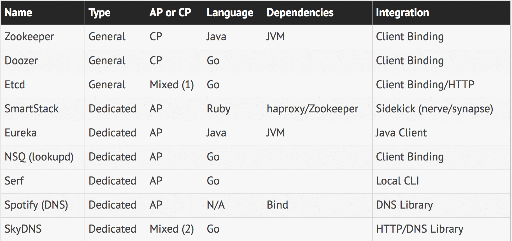

# 1. 服务注册与发现

开源服务发现组件的对比， 原文地址： http://jasonwilder.com/blog/2014/02/04/service-discovery-in-the-cloud/

## 1. Eureka Rest API

​      Eureka 提供Rest API接口，所以非Java应用也可使用Eureka服务。Rest API 地址： https://github.com/Netflix/eureka/wiki/Eureka-REST-operations

## 2. Eureka的设计

### 2.1 服务注册发现的核心操作：

1. 服务注册
2. 服务下线
3. 服务租约
4. 服务剔除

### 2.2 Eureka的设计理念

1. 服务注册： 依赖相关springboot start即可
2. 服务下线：正常情况下，服务实例关闭的时候，应该通过Hook或其他生命周期方法调用Eureka的Server端的Rest API的De-register接口。此外Eureka Clinet需要与Server端保持定时心跳，进行服务续约，如果Client端意外退出，超过一定时间没有续约，Sever端将主动剔除该实例。

### 2.3 Eureka注册实例一致性问题

1. AP由于CP：意味着在Eureka Server端，实例的注册信息并不是强一致的，可能有过期的数据，这就需要服务消费者能够支持失败重试的机制。

2. 对等复制：即Peer to Peer模式，副本之间不分主从，任何副本都可以写入，然后每个副本之间进行数据更新。

3. SELF Preservation: 在分布式系统设计里，通常需要对应用实例的存活进行健康检查，这里比较关键的问题时要处理好网络偶尔抖动或短暂不可用造成的误判。

   ​	Client与Sever端之间有个租约，Client要定时发送心跳来维持这个租约，表示自己还活着。Eureka通过当前注册的实例数，去计算每分钟应该收到的心跳数，如果最近一分钟收到的续约数小于指定的阈值，则关闭租约失效剔除。

   

# 2. Feign

## 2.1 工作原理

1. @EnableFeignClients注解开启对Feign Client的扫描，并将这些信息注入Spring IOC容器中。
2. 当Feign接口的方法被调用时，通过JDK的代理方式，生成具体的RequestTemplate对象，该对象封装了HTTP请求的全部信息。
3. 然后RequestTemplate生成Request，然后把Request交给Client处理。这里的Client可以是JDK原生的URLConnection、Apache的Http Client，也可以是okhttp。最后Client被封装到LoadBalanceClient，这个类结合Ribbon负载均衡发起服务之间的调用。

# 3. Ribbon负载均衡策略

| 策略类                   | 名称             | 描述                                                         |
| ------------------------ | ---------------- | ------------------------------------------------------------ |
| RandomRule               | 随机策略         | 随机选择Server                                               |
| RoundRobinRule           | 轮询策略         | 按顺序选择Server                                             |
| RetryRule                | 重试策略         | 在一个配置时间段内当选择server不成功，则一直尝试选择一个可用的server |
| BestAvailableRule        | 最低并发策略     | 逐个考察server，如果server断路器打开，则忽略，在选择其中并发连接最低的server |
| AvailabilityFilterRule   | 可用过滤策略     | 过滤掉一直连接失败并标记为circuit tripped的server和高并发连接是server |
| ResponseTimeWeightedRule | 响应时间加权策略 | 根据server的响应时间分配权重。响应时间越长，权重越低，被选择的概率就越低。 |
| ZoneAvoidanceRule        | 区域权衡策略     | 综合判断server所在区域的性能和server的可用性轮询选择server。 |

