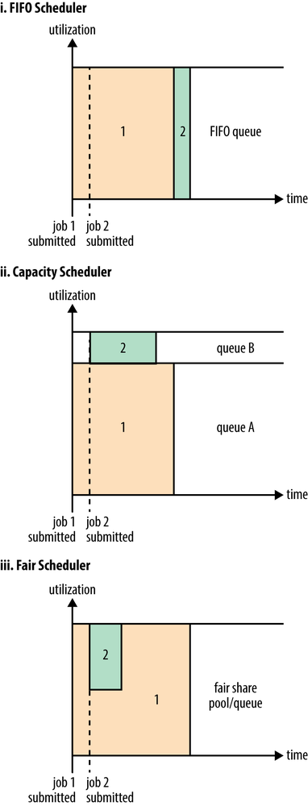

## 1. YARN的编程组件

1. ResourceManager： 是一个纯粹的调度器，根据应用程序的资源请求严格限制系统的可用资源。在保证容量、公平性及服务等级的前提下，优化集群资源的利用率。为了使用不同的策略，RM有一个可插拔的资源调度器来应用不同的调度算法

2. ApplicationMaster：时间上是特定框架的实例，负责与ResourceMAnager协商资源，并和NodeManager协同工作来执行和监控的Container以及它们的资源消耗。它有责任与ResourceManager协商并获取合适的资源Container，跟踪它们的状态，以及监控其进展。其特性有：

   - 将原先JobTracker容错、状态追踪等功能移入AM，RM成为一个纯粹的资源管理器，将复杂性引入了AM
   - AM本质是还是客户端代码，因此不能信息，不能是一个特权服务
   - 扩展性、开放性高，每种应用需开发自己的ApplicationMaster

3. ResourceRequest

   一个应用程序通过AM请求特定资源来满足他的资源需求。ResourceRequest包括以下信息：

    	1.  资源名称：期望资源所在的主机、机架名，用*表示没有特殊需求
    	2.  优先级：应用程序内部的优先级，用于调整内部资源申请顺序
    	3.  资源需求：内存多少、CPU多少
    	4.  Container数量

4. Container

​         Container的启动API是与平台无关的，包含以下元素：

​               1.启动Container的命令行

​               2.环境变量

​               3.启动Container进程所需的本地资源文件

​               4.安全相关的令牌

5. LocalResource：代表了运行Container所需的资源文件，包含以下信息：

   1. URL：资源的下载地址，一般放在HDFS；
   2. Size：资源的大小；
   3. Creation TimeStamp：资源的时间戳，用于检查文件是否被修改过，保证各个Container的资源的一致性视图
   4. LocalResourceType：包括FILE普通文件，ARCHIVE压缩文件，PATTERN前两种的组合；
   5. LocalResourceVisibility：指定本地化可见性

   

## 2. YARN的三种调度器

1. FIFO: 从工作队列中拉去最早提交的任务进行调度，不考虑作用的优先级和范围

2. Capacity：管理员需配置一个或多个队列，每个队列有严格的ACL限制，用于控制哪些用户可以向该队列提交应用。Capacity调度器允许共享集群，同时给每个用户或组一定的最小容量保证。这些最小值在不需要是可以放弃，超出的容量将会给那些处于饥饿的队列。

   用队列预留资源的方式保证了小任务提交即可执行，同时延长了大任务的执行时间。

3. Fair：不需要预留一系列最小容量值，它可以动态调整各个job的资源量。当只有一个 job 在运行时，该应用程序最多可获取所有资源，再提交其他 job 时，资源将会被重新分配分配给目前的 job，这可以让大量 job 在合理的时间内完成，减少作业 pending 的情况。




## 3. YARN APP运行流程


## 4. YARN运维相关

+ 日志聚合配置：

​        yarn-site.xml中yarn.log-aggregation-enable设为true；

​        yarn.nodemanager.remote-app-log-dir设置日志聚合HDFS目录，默认/tmp/logs; 日志聚合目录要有相关的权限

​        yarn.nodemanager.log-dirs: 设置在Container运行时日志保存在NM节点上的位置，默认值是 ${yarn.log.dir}/userrlogs

​	yarn.log-aggregation.retain-seconds：设置多长时间删除聚合后的日志

+ 增加或关闭YARN节点

  yarn.resourcemanager.nodes.include-path: 指定RM接受节点列表

  yarn.resourcemanager.nodes.exclude-path: 不会接受的节点列表；

  yarn rmadmin -refreshNodes   #通知RM刷新节点列表

+ YARN的web代理

  yarn的web代理是独立的代理服务器，出于安全性考虑，它集中管理者AM的web界面。默认情况下作为RM的一部分运行着，可以通过修改配置yarn.web-proxy.address让它以独立方式运行

+ 更新用户到用户组的映射

  配置项hadoop.security.group.mapping决定了RM中使用的用户与用户组的映射，默认是ShellBasedUnixGroupsMapping。无论何时向系统添加一个用户或修改用户组的用户列表，都需要更新：

  yarn rmadmin -refreshUserToGroupsMapping

+ 更新RM管理员ACL

  配置项：yarn.admin.acl

  更改后执行：yarn rmadmin -refreshAdminAcl

+  yarn RM重启作业保留机制

  1. 启动重启作业恢复，

  ```XML
  <property>
      <name>yarn.resourcemanager.recovery.enabled</name>
      <value>true</value>
   </property>
  ```

  2. 配置负责存储RM状态的类，由yarn.resourcemanager.store.class指定，目前有三类配置：

     `org.apache.hadoop.yarn.server.resourcemanager.recovery.ZKRMStateStore`： RM HA配置必须使用该类

     `org.apache.hadoop.yarn.server.resourcemanager.recovery.FileSystemRMStateStore`： 状态数存放在HDFS上，默认配置

     `org.apache.hadoop.yarn.server.resourcemanager.recovery.LeveldbRMStateStore`： 存储在本地levelDB数据库中，相对于前两种较轻量级

  3. 官方文档：https://hadoop.apache.org/docs/r2.7.3/hadoop-yarn/hadoop-yarn-site/ResourceManagerRestart.html#Configure_the_state-store_for_persisting_the_RM_state

+ 配置NodeManager支持重启恢复

  ```xml
  # NM启用重启恢复
  <property
      <name>yarn.nodemanager.recovery.enabled</name>
      <value>true</value>
   </property>
  # 存储状态数据的目录
  <property>
      <name>yarn.nodemanager.recovery.dir</name>
      <value><yarn_log_dir_prefix>/nodemanager/recovery-state</value>
   </property>
   # RPC地址，防止NM重启端口改变
   <property>
      <name>yarn.nodemanager.address</name>
      <value>0.0.0.0:45454</value>
   </property>
  ```

## 5. ResourceManager架构


+ Client Service:  实现了客户端接口ApplicationClientProtocol，包括如下操作：

  1. 应用程序提交

  2. 应用程序终止
  3. 获取应用程序、队列、集群统计信息，用户ACL

+ Admin Service：提供管理员操作接口，包括：

  1. 刷新队列：例如，新增队列、停止已有队列，改变队列配置
  2. 刷新RM管理节点的列表：新增退役节点的刷新
  3. 添加新用户组，添加/更新管理员ACL，修改超级用户的列表等

+ ApplicationMaster Service：响应AM的请求

  1. 注册新的AM
  2. 终止AM请求
  3. 获取AM的Container分配和释放请求，异步转发给yarn的调度器

+ Resource Tracker Manager：接受NM的RPC，有以下任务：

  1. 注册新节点
  2. 接收注册节点的心跳

+ ApplicationsManager：负责管理已提交的应用集合。

+ ApplicationMaster Launcher：负责拉起运行AM的Container；

+ ContainerAllocationExpirer：包含了一个已分配但还没有在NM上启动的Container列表。对于任意一个Container，如果在配置的时间内没有启动，RM将该Container当做死亡且超时

+ ContainerToken SecretManager：一个Container Token包含以下信息：

  1. Container ID
  2. NodeManager地址
  3. 应用程序提交者：提交应用到RM的用户
  4. 资源：内存、CPU等
  5. 超时时间戳：决定传递过来的Container令牌是否仍然合法
  6. RM标识符

+ AMRMToken：每个ApplicationAttempt对应一个令牌，用于AM与RM之间的认证。

+ NMToken：AM停止Container或获取Container的状态，与NM通信时使用


## 6. NodeManager的作用及组件

+ nodemanager的作用：

  1. 保持与RM的同步
  2. 跟踪节点状态
  3. 管理各个Container的生命周期，监控每个Container的资源使用情况
  4. 管理分布式缓存
  5. 管理各个Container生成的日志

  

+ NodeStatusUpdater:
  1. NM刚启动时该组件向RM注册
  2. 向RM提交当前Container信息
  3. 获取RM指令，例如杀死Container等
+ RPC Server：接受AM启动或停止Container的请求
+ 资源本地化：
  1. PUBLIC资源本地化：由Public-Localizer线程池处理。当本地化时，localizer验证请求资源的有效性，即通过检查他们在远程文件系统上的permission来检查是否真的可以是PUBLIC。该线程池的数量由yarn.nodemanger.localizer.fetch.thread-count配置
  2. PRIVATER/APPLICATION资源本地化：不是在nodemanager内部完成，而是在ContainerLocalizer的独立进程中完成的
  3. Containers Launcher: 维护了一个线程池，用于尽快地准备及拉起Container。同时负责清理。
  4. Container Monitor：在Container整个运行过程中监控它的资源使用率。如果有Container超出它分配值，这个组件会将Container杀死
  5. Container Executor：与底层操作系统交互，安全地启动和清理Container
  6. Node Health Checker：通过定期运行配置的脚本，提供对节点的健康检查


