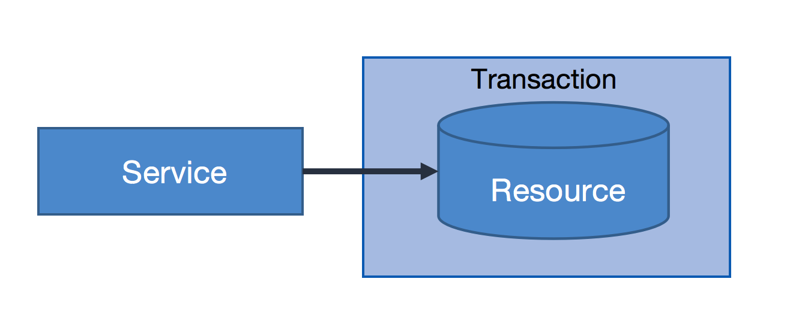
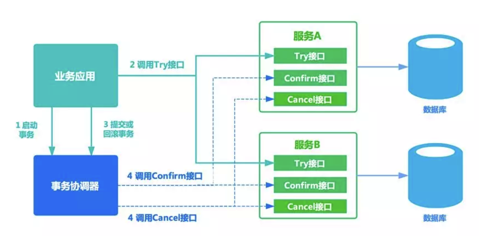
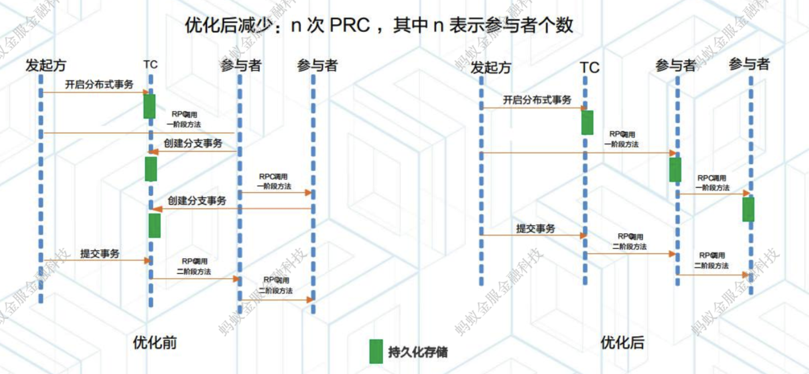
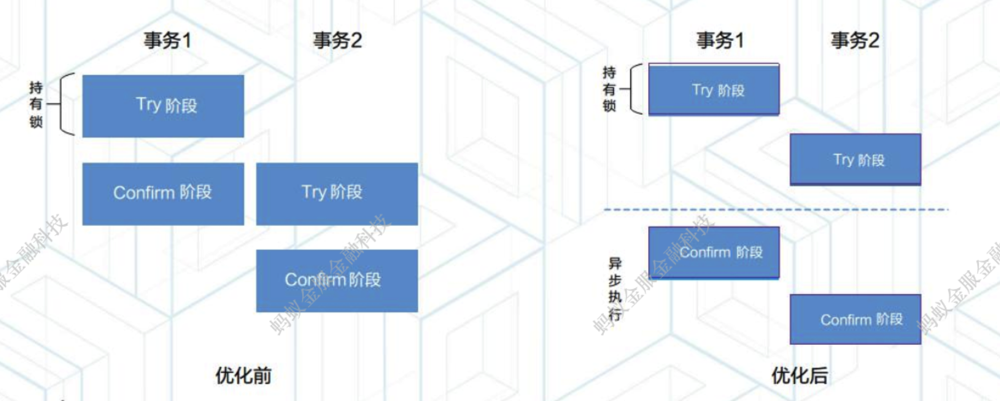
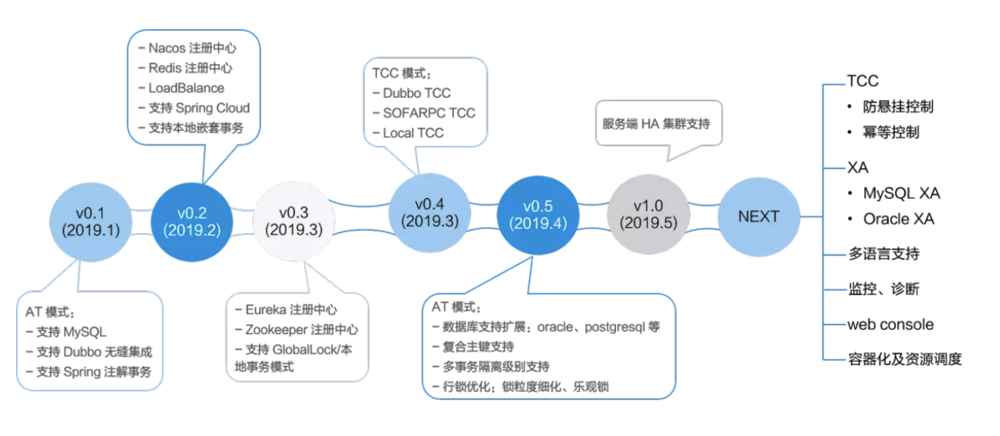
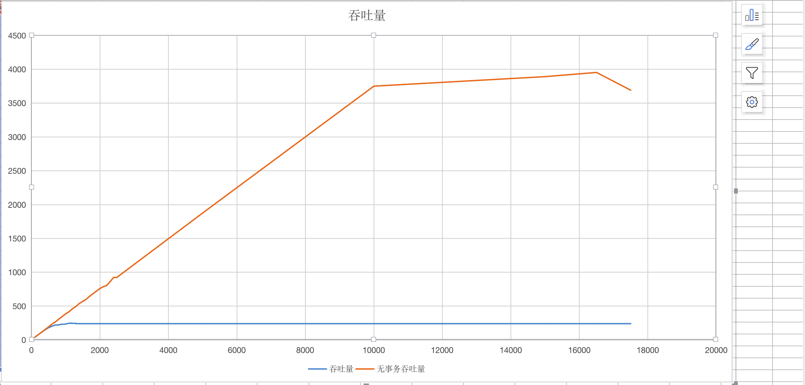

[TOC]

# 1. 分布式事务背景知识

## 1.1 分布式事务产生的背景

​	数据库事务具有原子性（Atomicity）、一致性（Consistency）、隔离性或独立性（Isolation）和持久性（Durabilily），简称ACID特性。对于单体应用，数据库事务用于保证数据之间的一致性。



​	但是随着应用规模的增加，需要将单体应用的各个服务进行拆分，并独立部署，这就形成了分布式服务的架构模式。采用跨多个数据库的应用在中大规模企业普遍存在，原来单体应用的一个操作也会分解成多个服务协作完成过程。例如预定行程的操作由预定酒店、预定租车等多个操作组成，每个服务对应不同的操作，并且每个服务操作不同的数据库。这就导致分布式事务的产生。


## 1.2 分布式事务解决方案

### 1.2.1 基于XA协议的两阶段提交

最早的分布式事务模型是 X/Open 国际联盟提出的 X/Open Distributed Transaction Processing（DTP）模型，也就是大家常说的 X/Open XA 协议，简称XA 协议。XA大致分为两部分：事务管理器（transaction manager）和本地资源管理器（local resource manager）。其中本地资源管理器由数据库实现，比如Oracle、DB2这些商业数据库都实现了XA接口，MySQL从5.5版本开始支持XA。而事务管理器作为全局的调度者，负责各个本地资源的提交和回滚。

DTP包含了三个核心组件：
	1. Application Program(AP) 应用服务器: 定义事务的边界，决定哪些是参与事务的分支。
	2. Resource Managers(RMs)资源管理器:  可以是数据库，数据库Drivers，SOA服务

​        3. Transaction Manager（TM）事务管理器：负责协调和管理事务，提供给AP编程接口及管理资源管理器


DTP协议包含两个阶段：

1. 第一阶段为准备阶段，即所有的参与者准备执行事务，并锁住需要的资源。参与者ready时，向事务管理器汇报自己已经准备好。

2. 第二阶段为提交阶段。当事务管理器确认所有参与者都ready后，向所有参与者发送commit命令。

XA协议比较简单，而且一旦商业数据库实现了XA协议，使用分布式事务的成本也比较低。但是，因为XA执行过程会对操作的数据表加锁，其他事务不能操作该数据库表，并发性能下降，XA无法满足高并发场景。XA目前在Oracle、DB2等商业数据库支持比较理想，但在MySQL数据库中支持的不太理想。MySQL的XA实现，没有记录prepare阶段日志，主备切换会导致主库与备库数据不一致。许多noSQL数据库也不支持XA，这让XA的应用场景变得非常狭隘。

XA协议存在的问题：

+ 同步阻塞：存在全局锁，所有参与事务锁定的资源其他事务阻塞。
+ 单点故障：TM发生故障，RM会阻塞。
+ 数据不一致：当协调者向参与者发送commit请求之后，发生了局部网络异常或者在发送commit请求过程中协调者发生了故障，导致只有一部分参与者接受到了commit请求。而在这部分参与者接到commit请求之后就会执行commit操作。但是其他部分未接到commit请求的机器则无法执行事务提交。于是整个分布式系统便出现了数据不一致性的现象。

### 1.2.2 TCC

TCC是一种比较成熟的分布式事务解决方案，可用于解决分布式事务数据一致性问题。其中TCC分别是Try、Confirm、Cancel三个单词的首字母，这也是该方案实现分布式事务的三个方法。TCC是服务化的两阶段编程模型，其Try、Confirm、Cancel 3个方法均由业务编码实现。其中Try操作作为一阶段，负责资源的检查和预留；Confirm操作作为二阶段提交操作，执行真正的业务；Cancel是预留资源的取消。TCC执行过程如图4所示。




TCC方案让应用自己定义数据库操作的粒度，使得降低锁冲突、提高吞吐量成为可能。 当然TCC方案也有不足之处，集中表现在以下两个方面：

- 对应用的侵入性强。业务逻辑的每个分支都需要实现try、confirm、cancel三个操作，应用侵入性较强，改造成本高。
- 实现难度较大。需要按照网络状态、系统故障等不同的失败原因实现不同的回滚策略。为了满足一致性的要求，confirm和cancel接口必须实现幂等。

**TCC在使用过程中可能遇到的问题：**

1. 空回滚：Try未执行，但Cancel执行了

2. 幂等：多次调用两阶段方法

3. 悬挂：cancel比try先执行

   

**TCC的优化方式：**

1. 同步模式改造：事务日志与业务数据在形同的库存储

   

2. 二阶段异步执行：一阶段同步执行，二阶段异步执行

   


### 1.2.3 SAGA

Saga事务模型又称为长时间运行的事务（Long lived transaction，LLTs）,它是由普林斯顿大学的H.Garcia-Molina等人在1987年提出，它描述了一种在没有两阶段提交的的情况下解决分布式系统中复杂的业务事务问题。

该模型的核心思想就是拆分分布式系统中的长事务（root transaction）为多个短事务（sub-transaction），或者叫多个本地事务，然后由Sagas工作流引擎负责协调，如果整个流程正常结束，那么事务成功完成；如果过程中出现失败，那么Sagas工作流引擎就会以相反的顺序调用补偿操作，重新进行业务回滚。

由请求者（caller）发起一个全局事务，全局事务又分解为汽车预定服务中的子事务，如果子事务执行成功，则全局事务执行成功；如果子事务执行失败，则执行补偿方法，消除事务执行过程对数据的影响，达到回滚的目的。

Saga执行过程中，将事务持久化在saga log中，通过saga log的回放，可以将saga恢复到任何状态。

由于Saga只需要做事件的持久化，而事件内容以JSON的形式存储，Saga log的实现非常灵活，数据库（SQL或NoSQL），持久消息队列，甚至普通文件可以用作事件存储，当然有些能更快地进行saga恢复状态。


# 2. Seata

## 2.1 简介

2019 年 1 月，阿里巴巴中间件团队发起了开源项目 [Fescar](https://link.juejin.im?target=http%3A%2F%2Fmp.weixin.qq.com%2Fs%3F__biz%3DMzU4NzU0MDIzOQ%3D%3D%26mid%3D2247485437%26idx%3D1%26sn%3De2fa8769966468faa63f1eeba7ec646c%26chksm%3Dfdeb359dca9cbc8b71a48fb6e127af57097a9eed5b6318fbced19f88d053af1ae1ddfcb74d8a%26scene%3D21%23wechat_redirect)（Fast & Easy Commit And Rollback），以 **高效** 并且对业务 **0 侵入** 的方式，解决 **微服务** 场景下面临的分布式事务问题。Fescar 开源后，蚂蚁金服加入 Fescar 社区参与共建，并在 Fescar 0.4.0 版本中贡献了 TCC 模式。**现在Fescar更名为**Seata，意为：Simple Extensible Autonomous Transaction Architecture，是一套一站式分布式事务解决方案。



## 2.2  原理与设计

### 2.2.1  如何定义一个分布式事务？

​       Seata把一个分布式事务理解成一个包含了若干 **分支事务** 的 **全局事务**。**全局事务** 的职责是协调其下管辖的 **分支事务** 达成一致，要么一起成功提交，要么一起失败回滚。此外，通常 **分支事务** 本身就是一个满足 ACID 的 **本地事务**。这是我们对分布式事务结构的基本认识，与 XA 是一致的。


其次，与 XA 的模型类似，Seata定义 3 个组件来协议分布式事务的处理过程。

 

Seata 中有三大基本组件：

- **Transaction Coordinator(TC)：**维护全局和分支事务的状态，驱动全局事务提交与回滚。

- **Transaction Manager(TM)：**定义全局事务的范围：开始、提交或回滚全局事务。

- **Resource Manager(RM)：**管理分支事务处理的资源，与 TC 通信以注册分支事务并报告分支事务的状态，并驱动分支事务提交或回滚。

  

一个典型的分布式事务过程：

1. TM 向 TC 申请开启一个全局事务，全局事务创建成功并生成一个全局唯一的 XID。
2. XID 在微服务调用链路的上下文中传播。
3. RM 向 TC 注册分支事务，将其纳入 XID 对应全局事务的管辖。
4. TM 向 TC 发起针对 XID 的全局提交或回滚决议。
5. TC 调度 XID 下管辖的全部分支事务完成提交或回滚请求。


### 2.2.2 与XA的区别

#### 架构层次


XA 方案的 RM 实际上是在数据库层，RM 本质上就是数据库自身（通过提供支持 XA 的驱动程序来供应用使用）。

而 Seata 的 RM 是以二方包的形式作为中间件层部署在应用程序这一侧的，不依赖与数据库本身对协议的支持，当然也不需要数据库支持 XA 协议。这点对于微服务化的架构来说是非常重要的：应用层不需要为本地事务和分布式事务两类不同场景来适配两套不同的数据库驱动。

这个设计，剥离了分布式事务方案对数据库在 **协议支持** 上的要求。

#### 两阶段提交

先来看一下 XA 的 2PC 过程。


无论 Phase2 的决议是 commit 还是 rollback，事务性资源的锁都要保持到 Phase2 完成才释放。

设想一个正常运行的业务，大概率是 90% 以上的事务最终应该是成功提交的，我们是否可以在 Phase1 就将本地事务提交呢？这样 90% 以上的情况下，可以省去 Phase2 持锁的时间，整体提高效率.


- 分支事务中数据的 **本地锁** 由本地事务管理，在分支事务 Phase1 结束时释放。
- 同时，随着本地事务结束，**连接** 也得以释放。
- 分支事务中数据的 **全局锁** 在事务协调器侧管理，在决议 Phase2 全局提交时，全局锁马上可以释放。只有在决议全局回滚的情况下，**全局锁** 才被持有至分支的 Phase2 结束。

这个设计，极大地减少了分支事务对资源（数据和连接）的锁定时间，给整体并发和吞吐的提升提供了基础。


### 2.2.3 分支事务的提交和回滚


**Phase1：**

Fescar 的 JDBC 数据源代理通过对业务 SQL 的解析，把业务数据在更新前后的数据镜像组织成回滚日志，利用 **本地事务** 的 ACID 特性，将业务数据的更新和回滚日志的写入在同一个 **本地事务** 中提交。

这样，可以保证：任何提交的业务数据的更新一定有相应的回滚日志存在。


基于这样的机制，分支的本地事务便可以在全局事务的 Phase1 提交，马上释放本地事务锁定的资源。

**Phase2：**

- 如果决议是全局提交，此时分支事务此时已经完成提交，不需要同步协调处理（只需要异步清理回滚日志），Phase2 可以非常快速地完成。


- 如果决议是全局回滚，RM 收到协调器发来的回滚请求，通过 XID 和 Branch ID 找到相应的回滚日志记录，通过回滚记录生成反向的更新 SQL 并执行，以完成分支的回滚。


### 2.2.4 Seata的隔离性

全局事务的隔离性是建立在分支事务的本地隔离级别基础之上的。

在数据库本地隔离级别 **读已提交** 或以上的前提下，Seata 设计了由事务协调器维护的 **全局写排他锁**，来保证事务间的 **写隔离**，将全局事务默认定义在 **读未提交** 的隔离级别上。**分支事务向TC注册时，将需要锁定的表及行号提交，用于建立全局排他锁。如果有其他的事务已经锁定，分支事务无法注册，最终触发回滚。**


## 2.3 Seata存在的问题

| 序号 | 问题描述                                                     |
| :--- | ------------------------------------------------------------ |
| 1    | 基于Netty TCP通信，但自定义的解码器没有处理TCP拆包粘包问题，在并发通信时消息解码存在异常，导致无法正常通信 |
| 2    | 存储方式采用文件存储，不支持数据库存储，放入Docker中需要固定到某一节点，事务数据不容易查询，给问题排查带来困难 |
| 3    | 存在单点问题，不能集群部署                                   |
| 4    | 与SpringCloud结合性不好，需要开发相应的RestTemplate、Feign的拦截器进行事务ID不同服务间的传输 |
| 5    | 自动补偿机制只支持mysql                                      |
| 6    | 分布式事务之间有隔离性，但此时其他本地事务仍可修改分布式事务锁定的数据，如果分布式事务回滚会直接覆盖本地事务修改的结果。因此如果一个业务表分布式事务在修改，就不要让本地事务也修改。 |


# 3. ServiceComb-pack

## 3.1 简介

Apache ServiceComb Saga 是一个微服务应用的数据最终一致性解决方案。

 具有如下特点：

l 高可用。支持集群模式。

l 高可靠。所有的事务事件都持久存储在数据库中。

l 高性能。事务事件是通过gRPC来上报的，且事务的请求信息是通过Kyro进行序列化和反序列化的。

l 低侵入。仅需2-3个注解和编写对应的补偿方法即可进行分布式事务。

l 部署简单。可通过Docker快速部署。

l 支持前向恢复（重试）及后向恢复（补偿）。

l 扩展简单。基于Pack架构很容实现多种协调机制。


## 3.2 架构

Saga Pack架构是由**alpha**和**omega**组成，其中：

+ alpha充当协调者的角色，主要负责对事务的事件进行持久化存储以及协调子事务的状态，使其得以最终与全局事务的状态保持一致。
+ omega是微服务中内嵌的一个agent，负责对网络请求进行拦截并向alpha上报事务事件，并在异常情况下根据alpha下发的指令执行相应的补偿操作。


### 3.3 Saga具体流程

Saga处理场景是要求相关的子事务提供事务处理函数同时也提供补偿函数。Saga协调器alpha会根据事务的执行情况向omega发送相关的指令，确定是否向前重试或者向后恢复。

### 成功场景

成功场景下，每个事务都会有开始和有对应的结束事件。


### 异常场景

异常场景下，omega会向alpha上报中断事件，然后alpha会向该全局事务的其它已完成的子事务发送补偿指令，确保最终所有的子事务要么都成功，要么都回滚。


### 超时场景 

超时场景下，已超时的事件会被alpha的定期扫描器检测出来，与此同时，该超时事务对应的全局事务也会被中断。


## 3.4 Tcc处理流程

TCC(try-confirm-cancel)与Saga事务处理方式相比多了一个Try方法。事务调用的发起方来根据事务的执行情况协调相关各方进行提交事务或者回滚事务。

### 成功场景

成功场景下， 每个事务都会有开始和对应的结束事件


### 异常场景

异常场景下，事务发起方会向alpha上报异常事件，然后alpha会向该全局事务的其它已完成的子事务发送补偿指令，确保最终所有的子事务要么都成功，要么都回滚。


### 3.5 压力测试



​	在相同环境下，我们对有分布式事务的服务与无分布式事务的进行压力测试，发现分布式事务对吞吐量影响很大。


### 3.6 存在的问题

| 序号 | 问题                                                         | 解决方式                                   |
| ---- | ------------------------------------------------------------ | ------------------------------------------ |
| 1    | 回滚失败没有做处理                                           | 回滚失败会发送补偿失败消息，后期需人工介入 |
| 2    | 发送补偿消息如果失败，alpha不断抛出异常                      | 未解决                                     |
| 3    | dao层过SQL过于复杂，数据库没有清理机制，随着数据增多性能下降 | 部分解决，未清理数据库                     |
| 4    | 如果事务运行超时，补偿可能在业务未结束前就开始               | 未解决                                     |
| 5    | 注册发现机制不健全，alpha、omega不能随意启停                 | 可随意启停                                 |
| 6    | Compensable的重试机制不合理。如果分支事务没有执行成功，如果设置重试会执行重试，直到失败。 | 未解决                                     |


# 3. 两种开源库的比较

|                      | Seata                                        | SerivceComb-Pack           |
| -------------------- | -------------------------------------------- | -------------------------- |
| 底层通信             | netty，通信不完善                            | grpc，通信完善             |
| 支持的分布式协议     | 改进的XA、TCC                                | Saga、TCC                  |
| 底层数据存储         | 关系数据库                                   | 文件                       |
| 部署方式             | 单点，对docker部署不友好                     | 集群，对docker方式部署友好 |
| 补偿方式             | 自动补偿，未来会加入人工补偿                 | 人工                       |
| 社区活跃度           | 高，star数量8k+                              | 低，star数量800            |
| 非TCC方式的隔离性    | 分布式事务之间有隔离，隔离级别等价于读未提交 | 分布式事务之间没有隔离     |
| 对spring cloud支持度 | 较低                                         | 较高                       |
|                      |                                              |                            |


# 4. ServiceComb-pack的开发方式

## 3.1 环境要求

-  JDK1.8；

+ maven 3.X；
+ 一个mysql数据库；


## 3.2 开发方式

1. 启动Eureka服务

2. 启动alpha服务

```shell
java -Dspring.profiles.active=mysql 
\-D"spring.datasource.url=jdbc:mysql://localhost:3306/saga?useSSL=true" 
\-jar alpha-server-0.4.0-SNAPSHOT-exec.jar 
\--eureka.client.enabled=true 
\--eureka.client.service-url.defaultZone=http://127.0.0.1:8761/eureka
```

3. 在项目pom文件中加入以下依赖

```xml
	<properties>
		<java.version>1.8</java.version>
		<spring-cloud.version>Greenwich.SR1</spring-cloud.version>
		<pack.version>0.4.0-SNAPSHOT</pack.version>
	</properties>
<dependencies>
		<dependency>
			<groupId>org.apache.servicecomb.pack</groupId>
			<artifactId>omega-connector-grpc</artifactId>
			<version>${pack.version}</version>
		</dependency>
		<dependency>
			<groupId>org.apache.servicecomb.pack</groupId>
			<artifactId>omega-spring-cloud-eureka-starter</artifactId>
			<version>${pack.version}</version>
		</dependency>
		<dependency>
			<groupId>org.apache.servicecomb.pack</groupId>
			<artifactId>omega-spring-starter</artifactId>
			<version>${pack.version}</version>
		</dependency>
		<dependency>
			<groupId>org.apache.servicecomb.pack</groupId>
			<artifactId>omega-transport-resttemplate</artifactId>
			<version>${pack.version}</version>
		</dependency>
</dependencies>
```


4. 在全局事务的起点添加 `@SagaStart` 的注解。

   ```java
    @SagaStart(timeout=10)
    public boolean transferMoney(String from, String to, int amount) {
      transferOut(from, amount);
      transferIn(to, amount);
    }
   ```

5. 在子事务处添加 `@Compensable` 的注解并指明其对应的补偿方法。其中，补偿方法的形参列表需与子事务方法的形参列表保持一致。

   ```java
    @Compensable(timeout=5, compensationMethod="cancel")
    public boolean transferOut(String from, int amount) {
      repo.reduceBalanceByUsername(from, amount);
    }
       
    public boolean cancel(String from, int amount) {
      repo.addBalanceByUsername(from, amount);
    }
   ```

   

# 5. 结论

+ seata目前还不成熟，存在的问题较多，达不到生产级别
+ ServiceComb-pack经过简单修改即可使用


