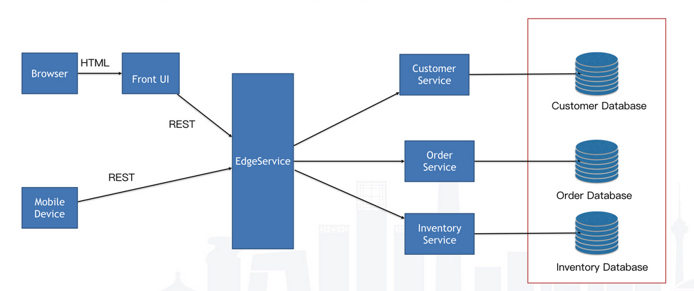
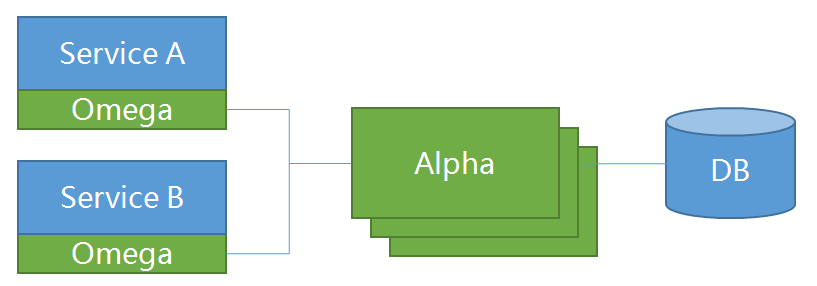

# 1. 分布式事务背景知识

## 1.1 分布式事务产生的背景

​	数据库事务具有原子性（Atomicity）、一致性（Consistency）、隔离性或独立性（Isolation）和持久性（Durabilily），简称ACID特性。对于单体应用，数据库事务用于保证数据之间的一致性。


​	但是随着应用规模的增加，需要将单体应用的各个服务进行拆分，并独立部署，这就形成了分布式服务的架构模式。采用跨多个数据库的应用在中大规模企业普遍存在，原来单体应用的一个操作也会分解成多个服务协作完成过程。例如预定行程的操作由预定酒店、预定租车等多个操作组成，每个服务对应不同的操作，并且每个服务操作不同的数据库。这就导致分布式事务的产生。




## 1.2 分布式事务解决方案

### 1.2.1 基于XA协议的两阶段提交

最早的分布式事务模型是 X/Open 国际联盟提出的 X/Open Distributed Transaction Processing（DTP）模型，也就是大家常说的 X/Open XA 协议，简称XA 协议。XA大致分为两部分：事务管理器（transaction manager）和本地资源管理器（local resource manager）。其中本地资源管理器由数据库实现，比如Oracle、DB2这些商业数据库都实现了XA接口，MySQL从5.5版本开始支持XA。而事务管理器作为全局的调度者，负责各个本地资源的提交和回滚。基于XA协议的两阶段提交原理如图1所示。


第一阶段为准备阶段，即所有的参与者准备执行事务，并锁住需要的资源。参与者ready时，向事务管理器汇报自己已经准备好。

第二阶段为提交阶段。当事务管理器确认所有参与者都ready后，向所有参与者发送commit命令。

XA协议比较简单，而且一旦商业数据库实现了XA协议，使用分布式事务的成本也比较低。但是，因为XA执行过程会对操作的数据表加锁，其他事务不能操作该数据库表，并发性能下降，XA无法满足高并发场景。XA目前在Oracle、DB2等商业数据库支持比较理想，但在MySQL数据库中支持的不太理想。MySQL的XA实现，没有记录prepare阶段日志，主备切换会导致主库与备库数据不一致。许多noSQL数据库也不支持XA，这让XA的应用场景变得非常狭隘。

xa协议的问题：

1. 


### 1.2.2 TCC

TCC是一种比较成熟的分布式事务解决方案，可用于解决分布式事务数据一致性问题。其中TCC分别是Try、Confirm、Cancel三个单词的首字母，这也是该方案实现分布式事务的三个方法。TCC是服务化的两阶段编程模型，其Try、Confirm、Cancel 3个方法均由业务编码实现。其中Try操作作为一阶段，负责资源的检查和预留；Confirm操作作为二阶段提交操作，执行真正的业务；Cancel是预留资源的取消。TCC执行过程如图4所示。

TCC与2PC相比，实现以及流程相对简单了一些，但数据的一致性比2PC也要差一些。TCC在confirm，cancel阶段都有可能失败。TCC属于应用层的一种补偿方式，所以需要程序员在实现时编写补偿的代码，并且在一些业务场景中，一些业务流程抽象出TCC补偿比较困难。

### 1.2.3 SAGA

Saga事务模型又称为长时间运行的事务（Long lived transaction，LLTs）,它是由普林斯顿大学的H.Garcia-Molina等人提出，它描述了一种在没有两阶段提交的的情况下解决分布式系统中复杂的业务事务问题。

该模型的核心思想就是拆分分布式系统中的长事务（root transaction）为多个短事务（sub-transaction），或者叫多个本地事务，然后由Sagas工作流引擎负责协调，如果整个流程正常结束，那么事务成功完成；如果过程中出现失败，那么Sagas工作流引擎就会以相反的顺序调用补偿操作，重新进行业务回滚。

图7.以一个汽车预定服务为例，描述了Saga执行的过程。

由请求者（caller）发起一个全局事务，全局事务又分解为汽车预定服务中的子事务，如果子事务执行成功，则全局事务执行成功；如果子事务执行失败，则执行补偿方法，消除事务执行过程对数据的影响，达到回滚的目的。

Saga执行过程中，将事务持久化在saga log中，通过saga log的回放，可以将saga恢复到任何状态。

由于Saga只需要做事件的持久化，而事件内容以JSON的形式存储，Saga log的实现非常灵活，数据库（SQL或NoSQL），持久消息队列，甚至普通文件可以用作事件存储，当然有些能更快地进行saga恢复状态。


# 2. Seata

## 2.1 简介


## 2.2  原理


## 2. 存在的问题

| 序号 | 问题描述                                                     | 解决方式   |
| ---- | ------------------------------------------------------------ | ---------- |
| 1    | 底层通讯基于Netty，但自定义的解码器没有处理TCP拆包粘包问题，在并发通信时消息解码存在异常，导致无法正常通信 | 重写解码器 |
| 2    | 存储方式采用文件存储，不支持数据库存储，放入Docker中需要固定到某一节点，事务数据不容易查询，给问题排查带来困难 |            |
| 3    | 存在单点问题，不能集群部署                                   |            |
| 4    | 与SpringCloud结合性不好，需要开发相应的RestTemplate拦截器进行事务ID不同服务间的传输 |            |
| 5    | 自动补偿机制只支持mysql                                      |            |
|      |                                                              |            |


# 3. ServiceComb-pack

## 3.1 简介

Apache ServiceComb Saga 是一个微服务应用的数据最终一致性解决方案。

 具有如下特点：

l 高可用。支持集群模式。

l 高可靠。所有的事务事件都持久存储在数据库中。

l 高性能。事务事件是通过gRPC来上报的，且事务的请求信息是通过Kyro进行序列化和反序列化的。

l 低侵入。仅需2-3个注解和编写对应的补偿方法即可进行分布式事务。

l 部署简单。可通过Docker快速部署。

l 支持前向恢复（重试）及后向恢复（补偿）。

l 扩展简单。基于Pack架构很容实现多种协调机制。


## 3.2 架构

Saga Pack架构是由**alpha**和**omega**组成，其中：

+ alpha充当协调者的角色，主要负责对事务的事件进行持久化存储以及协调子事务的状态，使其得以最终与全局事务的状态保持一致。
+ omega是微服务中内嵌的一个agent，负责对网络请求进行拦截并向alpha上报事务事件，并在异常情况下根据alpha下发的指令执行相应的补偿操作。



### 3.3 Saga具体流程

Saga处理场景是要求相关的子事务提供事务处理函数同时也提供补偿函数。Saga协调器alpha会根据事务的执行情况向omega发送相关的指令，确定是否向前重试或者向后恢复。

### 成功场景

成功场景下，每个事务都会有开始和有对应的结束事件。


### 异常场景

异常场景下，omega会向alpha上报中断事件，然后alpha会向该全局事务的其它已完成的子事务发送补偿指令，确保最终所有的子事务要么都成功，要么都回滚。


### 超时场景 

超时场景下，已超时的事件会被alpha的定期扫描器检测出来，与此同时，该超时事务对应的全局事务也会被中断。


## 3.4 Tcc处理流程

TCC(try-confirm-cancel)与Saga事务处理方式相比多了一个Try方法。事务调用的发起方来根据事务的执行情况协调相关各方进行提交事务或者回滚事务。

### 成功场景

成功场景下， 每个事务都会有开始和对应的结束事件


### 异常场景

异常场景下，事务发起方会向alpha上报异常事件，然后alpha会向该全局事务的其它已完成的子事务发送补偿指令，确保最终所有的子事务要么都成功，要么都回滚。


### 3.5 存在的问题

| 序号 | 问题                                                         | 解决方式                                   |
| ---- | ------------------------------------------------------------ | ------------------------------------------ |
| 1    | 回滚失败没有做处理                                           | 回滚失败会发送补偿失败消息，后期需人工介入 |
| 2    | 发送补偿消息如果失败，alpha不断抛出异常                      | 未解决                                     |
| 3    | dao层过SQL过于复杂，数据库没有清理机制，随着数据增多性能下降 | 部分解决，未清理数据库                     |
| 4    | 如果事务运行超时，补偿可能在业务未结束前就开始               | 未解决                                     |
| 5    | 注册发现机制不健全，alpha、omega不能随意启停                 | 可随意启停                                 |
| 6    | Compensable的重试机制不合理。如果分支事务没有执行成功，如果设置重试会执行重试 | 未解决                                     |


## 2.3 两种开源库的比较


# 3. ServiceComb-pack的开发方式

# 3.1 环境要求

-  JDK1.8；

+ maven 3.X；
+ 一个mysql数据库；


## 3.2 开发方式

1. 启动Eureka服务

2. 启动alpha服务

```shell
java -Dspring.profiles.active=mysql 
\-D"spring.datasource.url=jdbc:mysql://localhost:3306/saga?useSSL=true" 
\-jar alpha-server-0.4.0-SNAPSHOT-exec.jar 
\--eureka.client.enabled=true 
\--eureka.client.service-url.defaultZone=http://127.0.0.1:8761/eureka
```

3. 在项目pom文件中加入以下依赖

```xml
	<properties>
		<java.version>1.8</java.version>
		<spring-cloud.version>Greenwich.SR1</spring-cloud.version>
		<pack.version>0.4.0-SNAPSHOT</pack.version>
	</properties>
<dependencies>
		<dependency>
			<groupId>org.apache.servicecomb.pack</groupId>
			<artifactId>omega-connector-grpc</artifactId>
			<version>${pack.version}</version>
		</dependency>
		<dependency>
			<groupId>org.apache.servicecomb.pack</groupId>
			<artifactId>omega-spring-cloud-eureka-starter</artifactId>
			<version>${pack.version}</version>
		</dependency>
		<dependency>
			<groupId>org.apache.servicecomb.pack</groupId>
			<artifactId>omega-spring-starter</artifactId>
			<version>${pack.version}</version>
		</dependency>
		<dependency>
			<groupId>org.apache.servicecomb.pack</groupId>
			<artifactId>omega-transport-resttemplate</artifactId>
			<version>${pack.version}</version>
		</dependency>
</dependencies>
```


4. 在需要


