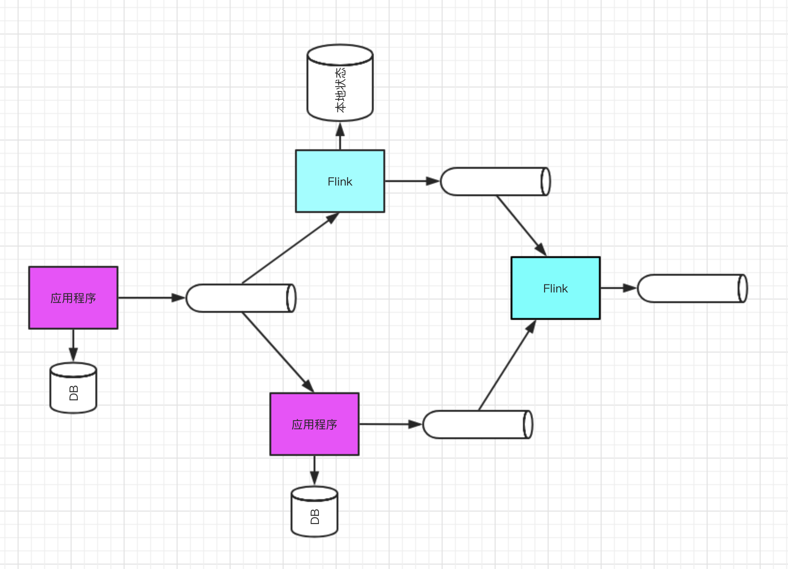

+ l浏览量放大f'd≤核心**；
+ 不止一个组件使用同一个消息流，他们的用途各不相同，不仅用于实时分析。这种设计支持数据集
+ 由消息队列连接应用程序，并作为新的数据源，取代以前大型集中式数据库；h叫花鸡 

​

​                                                                         图 3.1 传统实现实时分析的典型设计图

​

​                                                    图 3.2  流架构总体设计概念图

## 4. 消息传递系统

消息传递基础设施将是新架构实现的核心。该系统需要具备以下特征：

1. **生产者与消费者之间是完全独立的**，生产者不知道哪个消费者会处理消息；
2. **持久性**；
3. 每秒极高的消息处理率；
4. 支持Topic命名
5. **事件流可重放**
6. 容错性
7. 地理分布式复制

## 5. 流分析引擎的要求

1. **高度可扩展**：能在不丢失信息的情况下开始和结束，并提供与消息传递技术之间的接口；
2. 性能与低延迟：Flink、Apex目前可能是保持低延迟与高性能的最好选择，Storm提供中等性能水平的实时处理。
3. **Exactly-once** ：Streaming、Flink、Apex能够保证正好一次处理，storm支持最少一次处理。
4. **Window**：指流处理过程中执行聚合操作的时间周期。

