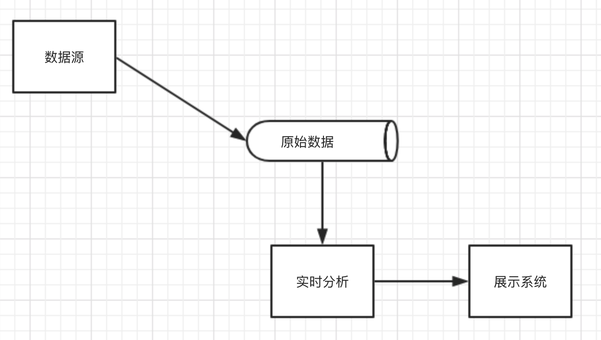
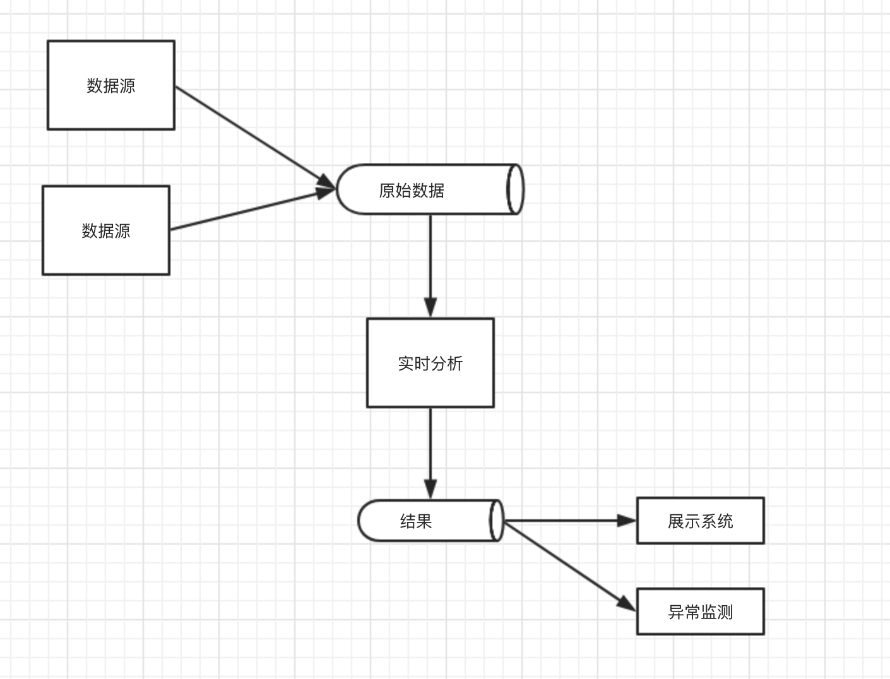

## 1. 流式计算为什么兴起？

+ 现实世界很多现象或事件都是连续不断的事件流。以数据流的形式收集或分析也是顺理成章的。
+ 现在出现了很多新兴的技术，**能够以大规模高性能的方式处理大规模的流数据**，因此越来越多的组织开始以流的方式处理数据。
+ **流数据持久化技术的进步**。以前持久化消息队列吞吐量大约是每秒上千，而现在新技术下能到到每秒百万个消息吞吐率。
+ **采用流式架构能够构建弹性系统**，因为解耦了传送消息与使用消息之间的依赖。很多的数据源可以以流的方式集成到一个新的数据平台中，供不同的消费者实时消费，或以后需要时消费。
+ **人们对于数据分析低延迟的需求，期望在事件发生时做出及时响应**。

## 2. 流式架构设计的核心点

+ 对流数据进行实时分析，在事件发生时及时做出响应；
+ 持久化流数据
+ 通过适当的技术可以将流数据复制到不同位置的数据中心；
+ 有效的消息传递系统是整个架构设计的核心，远远不止是服务于实时应用的队列。

## 3. 通用流式架构设计

+ 将数据流贯穿到整体架构中去。数据流式信息处理的默认方式，而不是特殊方式。
+ 不止一个组件使用同一个消息流，他们的用途各不相同，不仅用于实时分析。这种设计支持数据集成，整个过程采用流消息基础设施按需交付数据。

​                                                                         图 3.1 传统实现实时分析的典型设计图

​                                                    图 3.2  流架构总体设计概念图

## 4. 消息传递系统

消息传递基础设施将是新架构实现的核心。该系统需要具备以下特征：

1. **生产者与消费者之间是完全独立的**，生产者不知道哪个消费者会处理消息；
2. **持久性**；
3. 每秒极高的消息处理率；
4. 支持Topic命名
5. **事件流可重放**
6. 容错性
7. 地理分布式复制

## 5. 流分析引擎的要求

1. **高度可扩展**：能在不丢失信息的情况下开始和结束，并提供与消息传递技术之间的接口；
2. 性能与低延迟：Flink、Apex目前可能是保持低延迟与高性能的最好选择，Storm提供中等性能水平的实时处理。
3. **Exactly-once** ：Streaming、Flink、Apex能够保证正好一次处理，storm支持最少一次处理。
4. **Window**：指流处理过程中执行聚合操作的时间周期。

